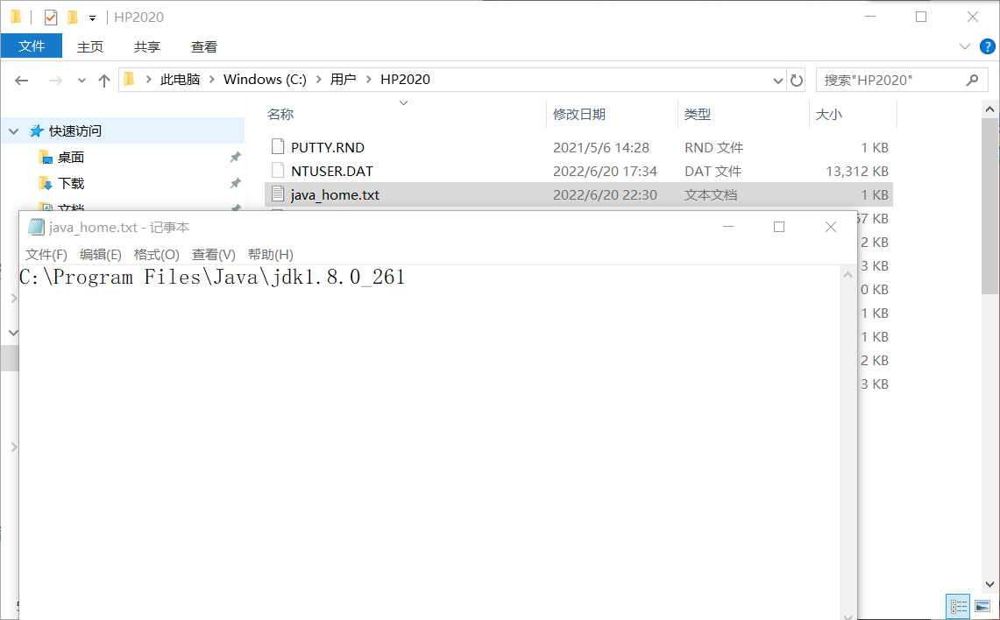

注：本文仅涉及少数几个基础的bat命令，没有深入讨论。

详见主要参考文章：[Bat 批处理教程](https://www.hxstrive.com/subject/windows_bat/111.htm)

## echo命令

显示消息，或者启用或关闭命令回显。

 ECHO [ON | OFF]
 ECHO [message]

若要显示当前回显设置，请键入不带参数的 ECHO。

## pause命令

暂停批处理程序，并显示以下消息：

> 请按任意键继续. . . 

## @符号

@ 符号的作用是屏蔽批处理程序中执行的命令行在 DOS 窗口显示（即在 DOS 中不显示执行的命令）。

## 重定向符号 > 与 >>

\> 和 >> 可以实现重定向，可将输出信息写入到文件和设备中，其区别是 \> 会覆盖之前文件中的内容，而 >> 会追加在末尾。

```bat
@echo %JAVA_HOME% > java_home.txt
```



上例建立在有配置过JAVA_HOME环境变量的情况下。

> **常见设备名：**
>
> - con 控制台（键盘和显示器）
> - aux , com1 - com4 所有串口
> - prn , lpt1 - lpt3 所有并口
> - nul 空设备
> - clock$ 电子钟

## 为批处理文件传递参数

```bat
echo %0
```

保存为demo.bat之后运行`demo.bat test`就可以得到下面结果。

```
test
```

如上例所示，更多参数可以用 %1 ~ %9 表示。

如果要传入多于九个函数可以使用shift命令。

```
echo   %1 %2 %3
shift /0   
echo   %1 %2 %3
```

保存为 demo.bat 之后运行 `demo.bat 1 2 3 4 5 6` 就可以得到下面结果。

```
1 2 3
2 3 4
```

shift 命令的 /N 参数是指从某个参数向前偏移，如 `shift /0` 就会将 %1 偏移到 %0，%2 偏移到 %1，以此类推，不能向后偏移且仅能偏移一位。

此处没有特别理解，并不一定准确，网上说法参差不齐，参考文章如下。

1. [批处理文件参数](https://www.hxstrive.com/subject/windows_bat/41.htm)
2. [%0 ~%9——给批处理batch脚本传递参数以及shift命令的用法](https://blog.csdn.net/sheji105/article/details/89011806)
3. [Microsoft Docs shift](https://docs.microsoft.com/en-us/windows-server/administration/windows-commands/shift)

