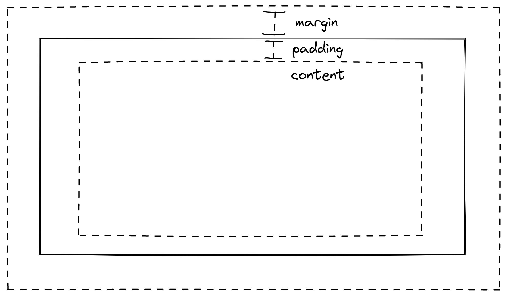

# Cascading Style Sheets - 层叠样式表

## 1 浅谈层叠样式表

简单来说，可以将 html 语言中的标签理解为数据的存放载体，而 CSS 则是存放载体的装饰。

也可以说 CSS 是各种元素的视觉属性值的集合，对其进行修改就可以改变元素外观。

> 样式表定义如何显示 HTML 元素，就像 HTML 中的字体标签和颜色属性所起的作用那样。样式通常保存在外部的 .css 文件中。我们只需要编辑一个简单的 CSS 文档就可以改变所有页面的布局和外观。
>
> 原文链接：https://www.runoob.com/css/css-intro.html

## 2 添加 CSS 的方式

### 2. 1 外部样式表

外部样式表是指将样式存储到一个外部的文件（ *.css ），通过在 head 中引用的方式使用它。

```html
<link rel="stylesheet" href="...">
```

rel 是 relation 的缩写，用这样的方式告诉页面通过 link 标签引入了一个样式表文件（ href 后应提供文件位置）。

### 2. 2 内部样式表

内部样式表是将样式直接放在页面 head 中的 style 标签中。

```html
<style>
    .nav-box {
        background-color: grey;
    }
</style>
```

在 style 标签之间填入样式即可。

### 2. 3 内联样式

内联样式在实际开发时（除特殊要求外）不常使用，原因是混乱导致难以维护。

```html
<a href="www.iamqwq.com" style="color: red;">Click!</a>
```

## 3 行内元素和块级元素

在详解各个元素属性前，要知道元素分为三种类型：行内元素、块级元素、行内块级元素。html 语言中的元素多数都是行内元素和块级元素。

行内元素可以多个并排一行，且 width、height 等属性均对其无效。行内元素的宽高（默认）取决于内部元素内容的变化。

块级元素独占一行，与行内元素相反的是：width、height 等属性有效。块级元素的宽度（默认）为父元素的宽度。

> |              | 是否独占一行 | width、height | padding、margin                               | 默认宽高             |
> | ------------ | ------------ | ------------- | --------------------------------------------- | -------------------- |
> | 块级元素     | 是           | 有效          | 有效                                          | 撑满父元素           |
> | 行内元素     | 否           | 无效          | padding有效；margin水平方向有效，竖直方向无效 | 随内部元素的内容变化 |
> | 行内块级元素 | 否           | 有效          | 有效                                          | 随内部元素的内容变化 |
>
> 作者：李赵同学猛猛哒
> 链接：https://juejin.cn/post/6844903593955328007
> 来源：稀土掘金
> 著作权归作者所有。商业转载请联系作者获得授权，非商业转载请注明出处。

## 4 各种样式

### 4. 0 盒模型

我认为应当将盒模型作为所有内容展开前的知识了解。盒模型是传统布局的核心思想，实线部分是元素的边框（ border），margin 为外边距，padding 为内边距，content 是元素实际内容所在的位置。

margin 和 padding 的值为长度单位，可以是 px、em、rem。或是 auto 和 % 等。



### 4. 1 文本属性

此节详解较为常用的关于文本 css 的属性，部分属性没有涉及，后同，不再赘述。

#### 4. 1. 1 文本颜色

color 属性可以设置文本颜色。可以通过多种形式的值表示颜色：

1. 颜色名称

   <span style="color: red;">iamqwq</span>

   ```html
   <span style="color: red;">iamqwq</span>
   ```

2. 十六进制值

   <span style="color: #FF88C2;">iamqwq</span>

   ```html
   <span style="color: #FF88C2;">iamqwq</span>
   ```

3. RGB 值

   <span style="color: RGB(20,200,240);">iamqwq</span>

   ```html
   <span style="color: RGB(20,200,240);">iamqwq</span>
   ```

4. RGBA 值

   <span style="color: RGBA(20,200,240,0.3);">iamqwq</span>

   ```html
   <span style="color: RGBA(20,200,240,0.3);">iamqwq</span>
   ```

   这种方式可以指定颜色的透明值（ 0 ~ 1 ）。

5. HSL 值

6. HSLA 值

#### 4. 1. 2 文本修饰

> text-decoration 属性用来设置或删除文本的装饰。
>
> 从设计的角度看 text-decoration属性主要是用来删除链接的下划线：
>
> ```css
> a {text-decoration:none;}
> ```
>
> 也可以这样装饰文字：
>
> ```css
> h1 {text-decoration:overline;} 
> 
> h2 {text-decoration:line-through;} 
> 
> h3 {text-decoration:underline;}
> ```
>
> 原文链接：https://www.runoob.com/css/css-text.html

#### 4. 1. 3 文本字体

##### 4. 1. 3. 1 字体样式


##### 4. 1. 3. 2 字体大小

font-size 属性可以设置字体大小。

单位可以是 px、em、rem、% 。其中 px 是像素，为绝对大小单位。em、rem 和 % 是相对大小单位。

1em 即等同于当前当前元素字体大小，即父元素指定的字体大小（若没有则是默认大小）。em 可以做到在上层元素指定绝对字体大小，而底层元素相对字体大小。

rem 的大小则是根据根元素的字体大小来指定最终大小（根元素一般是 body 标签）。

##### 4. 1. 3. 2 字体粗细

font-weight 属性可以设置字体粗细。

值可以是 normal（正常）、bold（粗体）、bolder（更粗）、lighter （更细）和 inherit（从父元素继承） 。数字（ 100 ~ 900 ），400 等同于 normal 。

#### 4. 1. 4 字符间距

letter-spacing 属性可以设置字符间距。

值可以是 normal、长度单位值（可以是负值）和 inherit 。

#### 4. 1. 5 行高

line-height 属性可以设置行高。

可以通过将 line-height 和块级元素的 height 值统一达到垂直居中的效果。

#### 4. 1. 6 文本对齐

text-align 属性可以设置文本对齐方式。

> `text-align` CSS 属性定义行内内容（例如文字）如何相对它的块父元素对齐。`text-align` 并不控制块元素自己的对齐，只控制它的行内内容的对齐。
>
> 原文链接：https://developer.mozilla.org/zh-CN/docs/Web/CSS/text-align

值 TODO

#### 4. 1. 7 文本

text-shadow 属性可以设置文本阴影。

有多种写法，此处仅使用一种演示：

text-shadow x轴偏移量 y偏移量 模糊半径 阴影颜色

<span style="text-shadow: 5px 2px 6px grey; font-size: 32px;">iamqwq</span>

```html
<span style="text-shadow: 5px 2px 6px grey; font-size: 32px;">iamqwq</span>
```

### 4. 2 链接属性

#### 4. 2 .1 链接状态

链接没有什么特别的属性（文本属性可以修饰链接向外展示的文字样式），但他们有不同的状态：

> - a:link - 正常，未访问过的链接
> - a:visited - 用户已访问过的链接
> - a:hover - 当用户鼠标放在链接上时
> - a:active - 链接被点击的那一刻
>
> 原文链接：https://www.runoob.com/css/css-link.html

```html
. . .
<style>
    a:hover {
        color: white;
    }
</style>
. . .
<a href="www.iamqwq.com">iamqwq</a>
```

### 4. 3 （块级元素的）尺寸属性

在标题中强调块级元素的尺寸的理由是，使用下面即将叙述的属性修饰行内元素大抵不会产生任何效果。

width 属性可以指定块级元素的宽度（长度单位、%、auto 或 inherit ，下同）。

height 属性可以指定块级元素的高度。

除了简单的指定 width 和 height 之外，我们还可以通过 min-width、max-width 和 min-height、max-height 来指定块级元素最小和最大的宽度和高度。设置它们的原因是，你可能想通过相对长度单位或者 % 来指定块级元素的长度，但是又想将它们限定在一个不离谱的绝对长度之内。

### 4. 4 边框属性

#### 4. 4. 1 边框样式

border-style 属性可以指定边框外观样式。常用的有以下种类：

> dotted: 定义一个点线边框
>
> dashed: 定义一个虚线边框
>
> solid: 定义实线边框
>
> double: 定义两个边框。 两个边框的宽度和 border-width 的值相同
>
> 原文链接：https://www.runoob.com/css/css-border.html

#### 4. 4. 2 边框颜色

border-color 属性可以指定边框的颜色。颜色允许的值与文字颜色允许的若干形式相同。

#### 4. 4. 2 边框宽度

border-width 属性可以指定边框的宽度。

#### 4. 4. 3 圆角边框

border-radius 属性可以指定边框的圆角程度。

border-radius 在使用全参数时，描述的圆角程度顺序为：左上角、右上角、右下角、左下角。整体为顺时针顺序。如果使用两个参数，描述的圆角程度顺序为：左上角和右下角、右上角和左下角。当然也可以使用单个参数（描述全体）。

### 4. 5 显示方式

display 属性可以指定元素的显示方式。

#### 4. 5. 1 隐藏元素

> 隐藏一个元素可以通过把display属性设置为"none"，或把visibility属性设置为"hidden"。但是请注意，这两种方法会产生不同的结果。
>
> visibility:hidden可以隐藏某个元素，但隐藏的元素仍需占用与未隐藏之前一样的空间。也就是说，该元素虽然被隐藏了，但仍然会影响布局。

#### 4. 5. 2 块级元素和行内元素的转换

通过 `display: block;` 可以将行内元素转为块级元素，反之通过 `display: inline;` 可转换为行内元素（同理 inline-block 也可以）。

### 4. 6 定位方式

position 属性可以指定元素的定位方式。

// TODO

1. static
2. relative
3. fixed
4. absolute
5. sticky

### 4. 7