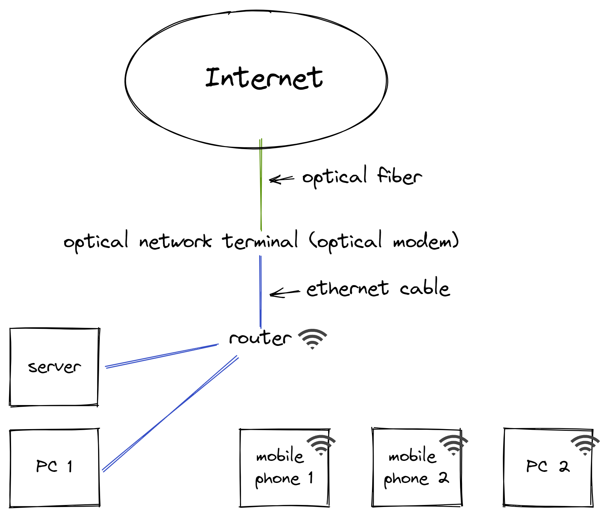
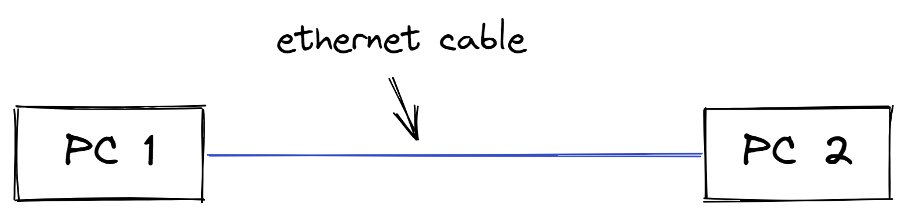
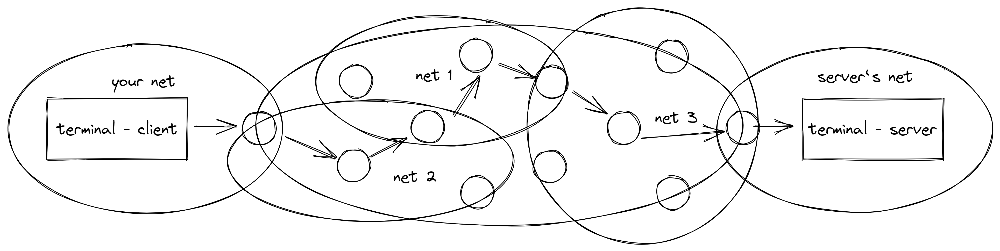
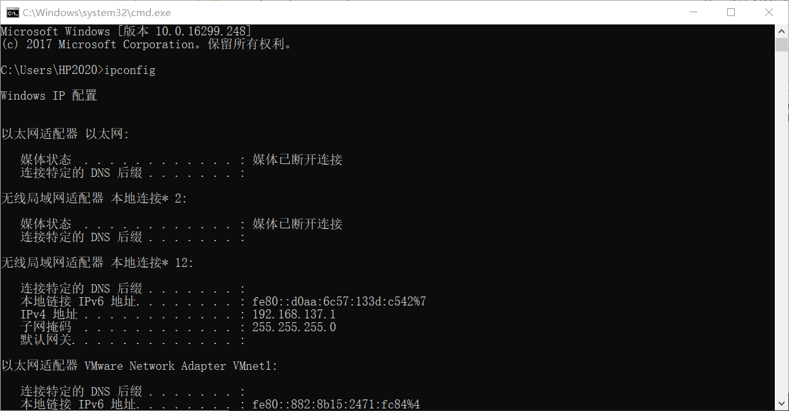
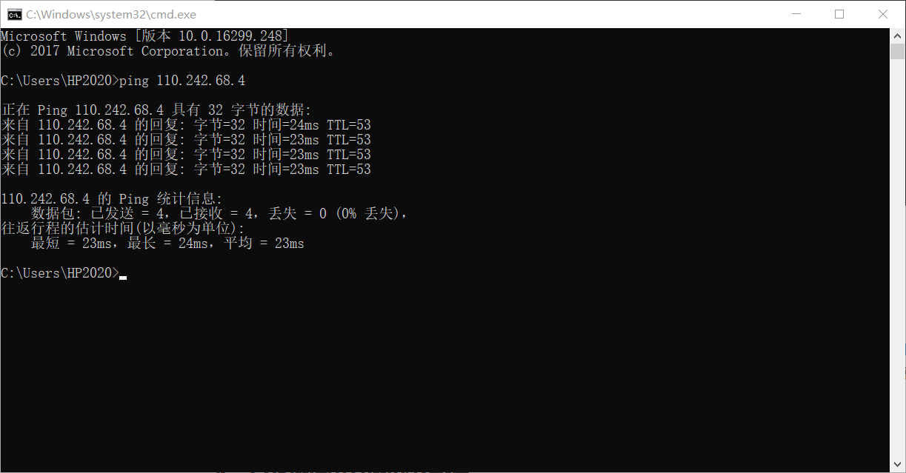

因特网 // TODO

# 0 前言

因为知识时效性问题故先在此说明该篇文章写于 2022 年 6 月，本文所涉及到的诸如传统、家用等概念也仅基于这个时间来描述。本文主要以入门级语言通俗精简的介绍未经改装的家庭网络，故不涉及软路由、交换机诸如此类设备及相关概念（因为我也不是很懂）。

# 1 传统家用网络拓扑结构

对于简单的了解家用网络及其设备的这个过程我认为不必像各大书籍一样从网络模型开始，我们从具体的、常见的家用网络拓扑结构开始一步步了解。

下例为绘制的一个较为常见的家用网络拓扑结构图（[绘制工具](https://excalidraw.com/)）：

单从图例可以看出 internet（互联网。注意与 Internet 区分，Internet 为因特网）中延伸出了 optical fiber（光纤，即为入户光纤）连接 optical network terminal 即 optical modem（光网络终端，即为光猫）。

光猫又以 ethernet cable（网线）连接 router（路由器）。

路由器通过网线的方式连接了 server （服务器）和 PC 1 （个人电脑 1），又通过无线的方式连接了 mobile phone （手机）等无线设备。

上文仅是大致的描述了家庭网络的结构，仅作一个大纲之用，从现在开始我们逐个进行了解。

# 2 何谓网络？（互联网概述和网络分类）

在资料的翻阅期间一般会遇见各种网络的分类，例如局域网、无线局域网、城域网、广域网，又比如互联网、因特网、万维网。这些概念因为计算机、各种通讯设备和网络技术的发展而复杂繁多。

退回到分类之前，我们先进行广义的网络的含义的讨论。

## 2. 1 网络和互联网

**网络**，其组建目的是让设备间可以互相通信，即是指当一个需要资源的设备向拥有资源的设备发出请求时，拥有资源的设备可以把请求的资源发回到请求资源的设备。

比如最简单的网络就是两台计算机（下图中为 PC 1 与 PC 2）通过可以互相传递数据的物理介质（下图中为ethernet cable，即为网线）连接起来，并且在计算机中安装可以处理这些数据接收和发送方式等等的网络控制软件，这样两台计算机就可以共享各种计算机资源了。这种情况我们可以说这两台计算机在局部区域组成了一个网络，这个网络即为一个 **local area network（局域网，即为LAN）**，一般我们的家庭网络也是一个局域网。

**互联网**，就是将这些局域网连接起来，这种将局域网连接的工程十分庞大，一般由你的 ISP （互联网服务提供商）负责这些工作。稍微复杂一点的局域网可以是之前我们绘制的家庭网络拓扑结构图，它和这种简单的局域网结构没有太大区别，只是多了一个将你所在局域网连接 ISP 所组建的你所在社区的网络的功能，而 ISP 再将各个社区的网络互相连接为县级或市级的网络，然后再次连接，以此类推。

我们回到一个**经过互联网**的两个设备之间的请求上。如上例所示，我们把发送请求的设备称之为 client（客户端），处理请求和回送请求的称之为 server（服务端）。而互联网的作用就是 forward（转发）这些请求，设法将从 client（客户端）与 server（服务端）之间找出一条可行的路径，并将这些请求送到。

我们会发现上述的转发这一过程**抽象掉了互联网中的细节**，我们利用已经讨论过的局域网的概念来稍微深入（并没有多深入）一些看一下这些细节。

上图是一个模拟互联网的模型，我们来解析这个请求传递的细节。

我们知道发起请求的客户端是身处一个局域网中，就像在家庭中的一台设备一样，它的请求如果想要传递给与客户端身处不同局域网的服务端，就需要将请求交由互联网中的转发设备（将图中的圆形视为转发设备）进行转发，将请求送到服务端所在的局域网。通过上图可以发现，转发的设备所在的网络也并不是身处同一个单一的网络，通常是经过多个大型的网络互相转发直到目标局域网。

这个发起请求的设备由上图看，我们可以发现处于整个网络的最边缘，所以称其为 terminal（端，或称终端），而这个转发设备通常为 router（路由器）。

在大致整理了上述概念后，我们可以通过简单的一句话来理解互联网。**互联网就是网络（各个局域网）的网络**。

## 2. 2 网络分类

// TODO

# 3 常见的（传统家用）网络设备

在家庭中常见的网络设备并不多，无非是光猫与路由器，本节就这两个设备以及物理介质作一个概念的简要的描述。

## 3. 1 调制解调器

因为信息在互联网中需要进行若干次转发，因此互联网的核心部分传递信息的速度需要足够快才能避免延迟过高。保证互联网核心部分传递信息的速度的办法除了优化网络的控制软件（即为协议）的方法以外，还有一种更好的方法，即让互联网核心的连接的物理介质传输信息的速率尽可能的快。有一种介质可以满足这种需求，即为光纤。

而现在网络普及程度越来越高，以至于光纤入户被提及的越来越多，这是指从 ISP 到用网区域的连接使用的物理传输介质为光纤。光纤，传输速度固然快，但其传输的信号为光信号，而数字设备是无法理解光信号的，这就需要接入网的局域网拥有一台转换设备，这个设备就是 optical network terminal（光网络终端，即为光猫），它负责将入户光纤中的光信号转换为数字信号。在也是通常情况下家庭网络会先将光猫与路由器连接的原因。

如果接入介质使用的不是光纤而是电话线，那么情况又有些变化。电话线传输的是模拟信号，那么就需要将模拟信号转换为数字信号，这个转换设备就是比光猫出现更早的猫（modem，即为传统的调制解调器），但他们在网络中的作用大抵相同。

## 3. 2 路由器

router（路由器），从名词本身来看，route 是路线的意思，而 router 的作用是完成数据在路线中的接受或传送并进行相应的处理。

简单来说，路由器在收到数据时候会将他们拆分成若干个部分，每个部分称作一个 packet（包），

## 3. 3 物理介质

在家庭中网络用数据传输的物理介质基本仅有两种，分别是光纤和双绞线（网线）。

### 3. 3. 1 光纤

> 1870年的一天，[英国](https://baike.baidu.com/item/英国)物理学家丁达尔到皇家学会的演讲厅讲光的[全反射](https://baike.baidu.com/item/全反射)原理，他做了一个简单的实验：在装满水的木桶上钻个孔，然后用灯从桶上边把水照亮。结果使观众们大吃一惊。人们看到，放光的水从水桶的小孔里流了出来，水流弯曲，光线也跟着弯曲，光居然被弯弯曲曲的水俘获了。
>
> 人们曾经发现，光能沿着从[酒](https://baike.baidu.com/item/酒)桶中喷出的细酒流传输；人们还发现，光能顺着弯曲的玻璃棒前进。这是为什么呢？难道光线不再直进了吗？这些现象引起了丁达尔的注意，经过他的研究，发现这是光的全反射 [2] 的作用，由于水等介质密度比周围的物质（如空气）大，即光从水中射向空气，当入射角大于某一角度时，折射光线消失，全部光线都反射回水中。表面上看，光好像在水流中弯曲前进。
>
> 后来人们造出一种透明度很高、粗细像蜘蛛丝一样的玻璃丝──玻璃纤维，当光线以合适的角度射入玻璃纤维时，光就沿着弯弯曲曲的玻璃纤维前进。由于这种纤维能够用来传输[光线](https://baike.baidu.com/item/光线/83074)，所以称它为光导纤维。

简单介绍光纤的特征即是传输速度快、传输带宽高、传输损耗小、抗干扰能力强，代价是价格高昂。一般网络核心部分会采用光纤，而现如今，接入网部分也开始使用光纤了。

### 3. 3. 2 双绞线

双绞线是由两根铜导线绞在一起，这也是它得名的原因。正因其材料的原因，传输速度、传输带宽和传输损耗都相对较差，一般双绞线长度不宜超过五十米。不过作为交换，其价格低廉，局域网中有线设备的连接主要靠的是双绞线。

双绞线分为若干类，千兆宽带基本采用六类线，其他详细分类如下：

> - 1类（CAT-1）：主要用于传输语音，用于[数据](https://zh.wikipedia.org/wiki/数据)传输。
> - 2类（CAT-2）：传输频率为1MHz，用于语音传输和最高传输速率4Mbps的数据传输，常见于使用4Mbps规范[令牌传递](https://zh.wikipedia.org/wiki/令牌傳遞)协议的旧的[令牌环](https://zh.wikipedia.org/wiki/令牌环)。
> - 3类（CAT-3）：指目前在[ANSI](https://zh.wikipedia.org/wiki/ANSI)和[EIA/TIA568](https://zh.wikipedia.org/w/index.php?title=EIA/TIA568&action=edit&redlink=1)标准中指定的电缆。该电缆的传输频率为16MHz，用于语音传输及最高传输速率为10Mbps的数据传输，主要用于[10BASE-T](https://zh.wikipedia.org/wiki/10BASE-T)。
> - 4类（CAT-4）：该类电缆的传输频率为20MHz,用于语音传输和最高传输速率16Mbps的数据传输，主要用于基于[令牌](https://zh.wikipedia.org/w/index.php?title=令牌&action=edit&redlink=1)的局域网和[10BASE-T](https://zh.wikipedia.org/wiki/10BASE-T)/[100BASE-T](https://zh.wikipedia.org/w/index.php?title=100BASE-T&action=edit&redlink=1)。
> - 5类（[CAT-5](https://zh.wikipedia.org/wiki/CAT-5)）：该类电缆增加了绕线密度，外套一种高质量的绝缘材料，传输频率为100MHz,用于语音传输和最高传输速率为100Mbps的数据传输，主要用于[100BASE-T](https://zh.wikipedia.org/w/index.php?title=100BASE-T&action=edit&redlink=1)和[10BASE-T](https://zh.wikipedia.org/wiki/10BASE-T)网络，这是最常用的[以太网](https://zh.wikipedia.org/wiki/以太网)电缆。
> - 超5类（CAT-5e）：超5类具有衰减小，[串扰](https://zh.wikipedia.org/wiki/串扰)少，并且具有更高的衰减与串扰的比值（ACR）和信噪比（Structural Return Loss）、更小的时延误差，性能得到很大提高。
> - 6类（[CAT-6](https://zh.wikipedia.org/wiki/CAT-6)）：10BASE-T/100BASE-T/1000BASE-T。传输频率为250MHz传输速度为1Gbps标准外径6mm。
> - 扩展6类（CAT-6A）：10GBASE-T。传输频率为500MHz传输速度为10Gbps标准外径9mm。
> - 扩展6类（CAT-6e）：传输频率为500MHz传输速度为10Gbps标准外径6mm。
> - 7类（CAT-7）：传输频率为600MHz传输速度为10Gbps单线标准外径8mm多芯线标准外径6mm。
> - 8类 (CAT-8)：40GBASE-T。传输频率为2000MHz传输速度为40Gbps。

## 3. 4 设备接口

此处所说的设备主要指猫和路由器。

### 3. 4. 1 WAN 接口

WAN（wide area network，即为广域网、外网、公网），通常跨接很大的物理范围。如果带有 WAN 标识的接口出现在设备上，说明可以插入接入网一端的设备的物理介质。

### 3. 4. 2 LAN 接口

LAN（local area network，即为局域网、内网），通常指有限区域内设备组成的网络。如果带有 LAN 标识的接口出现在设备上，说明可以插入连接需要网络的设备的物理介质。

# 4 随之出现的一些网络概念

当家用网络中的设备介绍完后，随之出现的就是一些概念，这里我们主要介绍其中的一部分。

我们以一个例子引入：在家中放置一台服务器，让身处别处的人们也同样可以访问这台服务器中的资源，我们需要做什么？

1. 我们需要在因特网的芸芸众生中找到目标主机的地址
2. 访问目标地址

## 4. 1 IPv4地址和端口

### 4. 1. 1 IPv4地址

> 当设备连接网络，设备将被分配一个IP地址，用作标识。通过IP地址，设备间可以互相通讯，如果没有IP地址，我们将无法知道哪个设备是发送方，无法知道哪个是接收方。[[2\]](https://zh.wikipedia.org/wiki/IP地址#cite_note-:0-2) IP地址有两个主要功能：**标识设备或网络**和**[寻址](https://zh.wikipedia.org/wiki/網路位址)**。

IPv4 一般由四个字节来表示一个地址（相对的，IPv6 则用六个字节来表示，IPv6 是为了解决 IPv4 资源枯竭的问题而出现的），当我们发送数据给目标主机的时候我们首先需要知道他的 IP 地址，路由器就负责根据 IP 地址进行寻址。

如果是在 windows 系统下可以通过 win + r 的快捷键输入 cmd 打开命令行窗口 键入 ipconfig 来查看自己所在网络的 IP 地址。

我们可以使用 ping 命令来获取对应地址的响应（如果他开启了 ping 的响应功能的话）。

### 4. 1. 2 端口

port（端口）一般和 IP 地址成对出现，一个客户端程序或服务端程序可以占用主机的 1024 - 65535 号端口（1 - 1023 号端口为系统保留端口）。如果要表示某个数据的发送源时，会以 IP:Port 的格式表示，一个 IP 地址和一个端口一对一的绑定，可以清晰的表示数据是由谁，以及由这个人的哪个应用程序发送的。

## 4. 2 外网和内网的相连

> 广域网和局域网，两者通过一个网络层设备（如路由器）相连，所以路由器会同时具有WAN口和LAN口。
>
> 可以说，每接入一个路由器，就可以生成一片子网。

### 4. 2. 1 网络地址转换

> **网络地址转换**（英语：**N**etwork **A**ddress **T**ranslation，缩写：**NAT**；又称**网络掩蔽**、**IP掩蔽**）在[计算机网络](https://zh.wikipedia.org/wiki/計算機網絡)中是一种在IP[数据包](https://zh.wikipedia.org/wiki/封包)通过[路由器](https://zh.wikipedia.org/wiki/路由器)或[防火墙](https://zh.wikipedia.org/wiki/防火牆)时重写来源[IP地址](https://zh.wikipedia.org/wiki/IP地址)或目的IP地址的技术。这种技术被普遍使用在有多台主机但只通过一个公有IP地址访问[互联网](https://zh.wikipedia.org/wiki/網際網路)的[私有网络](https://zh.wikipedia.org/wiki/私有网络)中。它是一个方便且得到了广泛应用的技术。当然，NAT也让主机之间的通信变得复杂，导致了通信效率的降低。

如果你自己使用两台计算机，尝试使用 ping 来获取另一台身处不同局域网的计算机的响应，那么大概率是连接超时。// TODO

Refrence：

书籍 - 《计算机网络：自顶向下的方法》[美] James，F.Kurose，Keith，W.Ross 著，陈鸣 译

[基础·计算机网络](https://zhuanlan.zhihu.com/p/57963415)

[因特网，万维网，互联网什么区别？](https://zhuanlan.zhihu.com/p/104150541)

[上网常说的光猫究竟是什么？](http://www.luyouqi.net/dnwl/475.html)

[[服务器应用] 详解端口映射失败的原因](https://www.mcbbs.net/thread-145600-1-1.html)