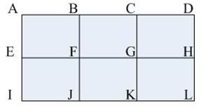

### 问题 G: 哨兵

#### 题目描述

在一个n×m的方格中，每个格点上站有一个人，如下图n=3，m=4的方格中；
 
共站有12人。在方格的左上角A点有一个哨兵，他能看到的人有A，B，E，F，G，H，J，L格点上的人数共8人，C，D格点被B挡住，I格点被E挡住，K格点被F挡住，所以C，D，I，K格点上的人看不到。
那么，当n，m给出之后(2≤n，m≤100)，哨兵可以看到多少人。

#### 输入

一行两个整数n和m

#### 输出

一个整数，即哨兵可以看到的人数。

#### 样例输入

```
4 4
```

#### 样例输出

```
10
```