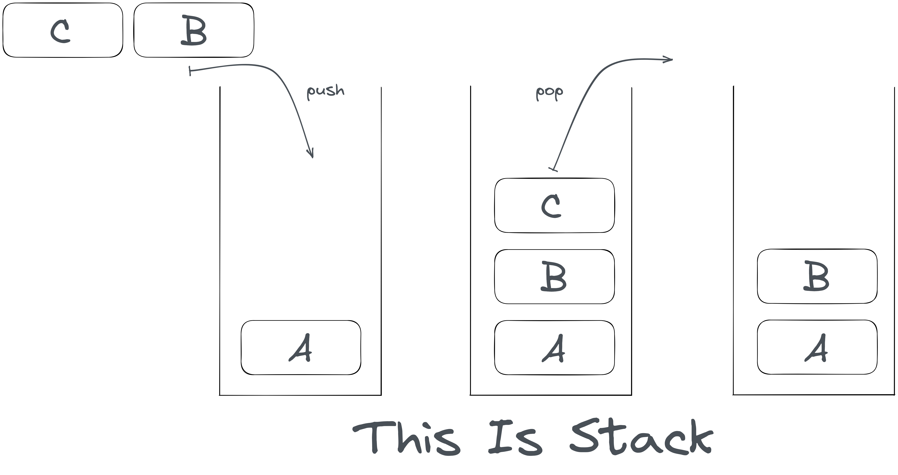

# Linear List - 线性表

> 线性表（ List ）：零个或多个数据元素的有限序列。

**有限序列**即是在说元素有限，但更重要的是元素之间存在顺序。

## 1 线性表的顺序存储结构

顺序结构指的是在内存中用一段连续的地址来存储数据的结构。

这种结构的优势在于可以根据元素下标快速计算每个元素的地址，也就是查找元素的速度很快。但缺点在于每次插入或移除元素则需要把后续所有的元素进行移动，即增删慢。

```c
typedef struct ArrayList {
	int *head;
	int length;
	int size;
	int growthScale;
} ArrayList;

ArrayList createArrayList(int size) {
	ArrayList l;
	l.head = (int *)malloc(size * sizeof(ArrayList));
	l.size = size;
	l.length = 0;
	l.growthScale = 1;
	return l;
}

int getElement(ArrayList l, int i) {
	if(i > l.length) {
		exit(0);
	}
	return *(l.head + i);
}

void setElement(ArrayList *l, int i, int data) {
	if(i < l->length) {
		*(l->head + i) = data;
	} else {
		exit(0);
	}
}

// This function means add a new element to the last position.
void addElement(ArrayList *l, int data) {
	if(l->length >= l->size) {
		l = (ArrayList *)realloc(l, l->size + l->growthScale);
	}
	*(l->head + l->length) = data;
	l->length++;
}

void insertElement(ArrayList *l, int i, int data) {
	int j;
	if(l->length >= l->size) {
		l = (ArrayList *)realloc(l, l->size + l->growthScale);
	}
	for(j = l->length; j >= i; j--) {
		*(l->head + j + 1) = *(l->head + j);
	}
	l->length++;
	*(l->head + i) = data;
} 

// And the deleteElement function hasnt written yet.
```


## 2 线性表的链式存储结构

链式结构意味着每个元素都指明了下一个元素的位置，实现这种结构的方式是一个元素分为两个部分：其一是数据域，用来存储数据；其二是指针域。

很显然，增减元素比大规模的元素移动简单多了。但链式的结构同时也会让进行查找元素的操作不得不首先访问其前面的所有元素。稍作总结：增删快，查找慢。

```c
typedef struct Node {
	int data;
	struct Node *next;
} Node, LinkedList;

LinkedList createLinkedList() {
	Node n;
	n.next = NULL;
	return n;
}

int getElement(LinkedList l, int i) {
	Node p;
	int j = 0;
	while(l.next != NULL && j <= i) {
		l = *(l.next);
		j++;
	}
	return l.data;
}

void addElement(LinkedList *l, int data) {
	Node *p;
	p = l;
	while(p->next != NULL) {
		p = p->next;
	}
	p->next = (LinkedList *)malloc(sizeof(LinkedList));
	p = p->next;
	p->data = data;
	p->next = NULL;
}

void insertElement(LinkedList *l, int i, int data) {
	Node *p = l;
	Node *t;
	int j = 0;
	while(l->next != NULL && j < i) {
		p = p->next;
		j++;
	}
	if(j == 0) {
		exit(0);
	}
	t = p->next;
	p->next = (Node *)malloc(sizeof(Node));
	p = p->next;
	p->data = data;
	p->next = t;
} 
```

## 3 栈：特殊的线性表结构

栈是一个受限制的线性表。将若干元素添加到栈后，如果想要查看并删除元素则总是最后添加的元素先被弹出。即栈是一种先进后出的数据结构，它被用于递归（由于在递归过程中需要保存调用自身前的数据，因此需要一个栈）的实现、中缀表达式和后缀表达式转换等。一般我们称将元素添加到栈叫做压栈，而查看并删除元素叫做出（又称弹）栈。对应的英文名称分别为 Push 和 Pop。



我们用自然语言描述的计算表达式是运算符在数字之间，这对计算机并不友好。因为计算机需要知道计算的两个数字，然后才能进行对应的运算操作，然而由于运算符优先级的存在，运算符左右两侧的数字也并不一定是需要进行运算的数字。因此这种被称作 " 中缀表达式 " 的表达式形式需要进行一些逻辑上的处理让计算机计算机直接进行运算，这就是 " 后缀表达式 "。例如 1 + 2 * 3 ，转换为后缀表达式之后的结果是 1 2 3 * + ，解读的方法是把运算符前的两个数字进行对应运算：

1 **2 3 *** + 

**1 6 +**

7

> 后缀式即逆波兰式，是波兰逻辑学家卢卡西维奇（Lukasiewicz) 发明的一种表示表达式的方法。 这种表示方式把运算符写在运算对象的后面，例如，把a+b写成ab+，所以也称为后缀式。 这种表示法的优点是根据运算对象和算符的出现次序进行计算，不需要使用括号，也便于用械实现求值。

下示代码以一种比较笨拙的方法实现了中缀与后缀表达式之间的转换（可能存在错误，且没有支持括号）。

```c
#include <stdio.h>
#include <stdlib.h>
#include <string.h>

typedef struct Stack {
	char *head;
	int top;
	int size;
} Stack;

Stack createStack(int n) {
	Stack s;
	s.head = (char *)malloc(n * sizeof(char));
	s.size = n;
	s.top = -1;
	return s;
}

int isEmpty(Stack s) {
	if(s.top == -1) {
		return 1;
	} else {
		return 0;
	}
}

void push(Stack *s, char data) {
	if(s->top >= s->size - 1) {
		// printf("Stack Full");
		return;
	} else {
		*(s->head + (++s->top)) = data;
	}
}

char pop(Stack *s) {
	if(s->top == -1) {
		// printf("Stack Empty");
		return NULL;
	} else {
		return *(s->head + (s->top--));
	}
}

int getPriority(char c) {
	if(c == ')') {
		return 1;
	}else if(c == '/' || c == '*' || c == '%') {
		return 3;
	} else if(c == '+' || c == '-') {
		return 4;
	} else if(c == '(') {
		return 15;
	} else if(c == 0) {
		return NULL;
	}
}


void convertToSuffix(char *str) {
	// 输入字符串
	// 运算数直接输出
	// 运算符优先级低于栈顶则压栈
	// 运算符优先级高于栈顶则弹出输出 再次比较直到低于为止
	
	Stack s = createStack(10); 
	int currentP;
	int stackTopP;
	char t;
	
	int i;
	for(i = 0; i < strlen(str); i++) {
		// Numbers
		if(*(str + i) >= '0' && *(str + i) <= '9') {
			printf("%c", *(str + i));
		} else {
		// Operators
			currentP = getPriority(*(str + i));
			stackTopP = getPriority(t = pop(&s));
			if(currentP < stackTopP || stackTopP == 0) {
				if(stackTopP != 0) {
					push(&s, t);
				}
				push(&s, *(str + i));
			} else {
				char ttop = *(str + i);
				printf("%c", t);
				while(1) {
					currentP = stackTopP;
					stackTopP = getPriority(t = pop(&s));
					if(currentP >= stackTopP && stackTopP != NULL) {
						printf("%c", t);
					} else {
						push(&s, t);
						push(&s, ttop);
						break;
					}
				}
			}
		}
	}
	while(!isEmpty(s)) {
		printf("%c", pop(&s));
	}
} 

int main() {

	char s[] = "7/1+2*5-1"; // Any expressions here (cannot include brackets).
	convertToSuffix(s);
	
} 
```

