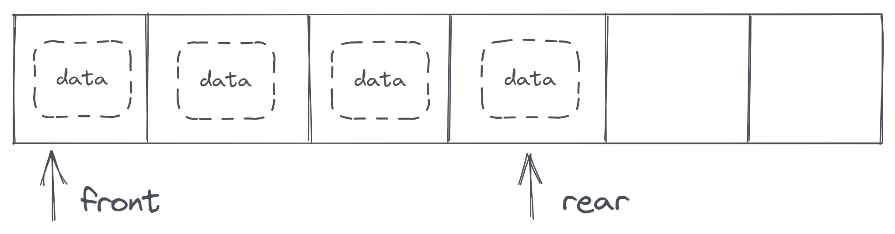

# Queue - 队列

队列也是一种操作受限的线性表。放在现实中很常见：队列是先排队的人先进行操作。在计算机中，队列同样常见：如果有一系列的操作任务需要按顺序执行，则会将任务存入队列进行排队，逐次执行。队列是一种先入先出的数据结构，同样是限制只能在结构尾部。

## 0 顺序存储结构队列的一些问题

首先我们很轻易的能想到的是例如下图的设计：



在这种设计中，当我们在队列进行插入删除操作的时候（遵循先入先出的原则）一定是在队尾插入、在队首删除或者在队尾删除、队首插入。

当添加元素时，在队尾直接添加元素，时间复杂度为 O(1) ；当删除元素时，在队首删除元素，然后将所有元素整体前移，时间复杂度为 O(n) 。队首（ front ）的位置是永远不变的。

可以发现在增删中一定会有一步的时间复杂度为 O(n) 。但这是可以优化的，即是采用循环的顺序存储结构的队列。其核心思想是当在队首删除元素后，并不将所有元素整体前移，而是标志前移，留下的空位供后续插入使用，这种实现在后面实现。


需要注意的是，在循环的顺序存储结构队列中，能够存储的元素数量是实际空间数量 - 1 个，因为循环队列需要依靠检查首尾标志是否重合来确定自身是否为空。

## 1 队列的循环顺序存储结构实现

```c
typedef struct Queue {
	int *head;
	int front;
	int rear;
	int size;
} Queue;

Queue createQueue(int size) {
	Queue q;
	q.head = (int *)malloc((size + 1) * sizeof(int));
	q.size = size;
	q.rear = 0;
	q.front = 0;
	return q;
}

int isQueueEmpty(Queue q) {
	if(q.front == q.rear) {
		return 1;
	} else {
		return 0;
	}
}

int isQueueFull(Queue q) {
	if((q.rear + 1) % (q.size + 1) == q.front) {
		return 1;
	} else {
		return 0;
	}
}

void addElement(Queue *q, int data) {
	if(!isQueueFull(*q)) {
		q->rear = (q->rear + 1) % (q->size + 1);
		*(q->head + q->rear) = data;
	}
}

int deleteElement(Queue *q) {
	if(!isQueueEmpty(*q)) {
		q->front = (q->front + 1) % (q->size + 1);
		return *(q->head + q->front);
	}
}
```

## 2 队列的链式存储结构

