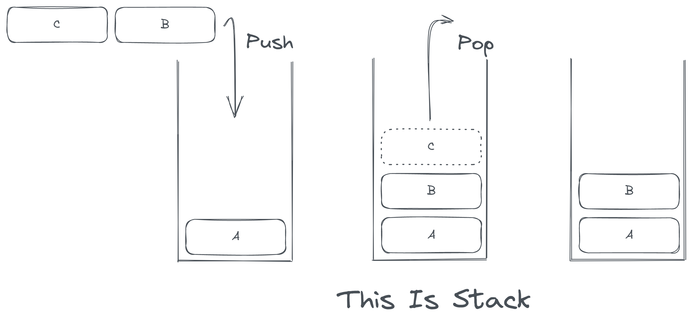

# Stack - 堆栈

堆栈是一个受限制的线性表，即堆栈是一种先进后出的数据结构。在现实中，枪械的弹匣是一个堆栈：最后装填的子弹将会被最先使用，而最先装填的子弹将会被最后使用。浏览器的回退功能也是一个栈：点击回退将会回到最后浏览的页面，而不断点击回退将回到最开始浏览的页面。受限制指的是堆栈被限定为只能在整个结构的尾部插入或删除元素。

它被用于递归（由于在递归过程中需要保存调用自身前的数据，因此需要一个堆栈）的实现、中缀表达式和后缀表达式转换等。一般我们称将元素添加到堆栈叫做入（又称圧）栈，而查看并删除元素叫做出（又称弹）栈。对应的英文名称分别为 Push 和 Pop。



## 堆栈应用：中缀表达式与后缀表达式转换

我们用自然语言描述的计算表达式是运算符在数字之间，这对计算机并不友好。因为计算机需要知道计算的两个数字，然后才能进行对应的运算操作，然而由于运算符优先级的存在，运算符左右两侧的数字也并不一定是需要进行运算的数字。因此这种被称作 " 中缀表达式 " 的表达式形式需要进行一些逻辑上的处理让计算机计算机直接进行运算，这就是 " 后缀表达式 "。例如 1 + 2 * 3 ，转换为后缀表达式之后的结果是 1 2 3 * + ，解读的方法是把运算符前的两个数字进行对应运算：

1 **2 3 *** + 

**1 6 +**

7

> 后缀式即逆波兰式，是波兰逻辑学家卢卡西维奇（Lukasiewicz) 发明的一种表示表达式的方法。 这种表示方式把运算符写在运算对象的后面，例如，把a+b写成ab+，所以也称为后缀式。 这种表示法的优点是根据运算对象和算符的出现次序进行计算，不需要使用括号，也便于用械实现求值。

下示代码以一种比较笨拙的方法实现了中缀与后缀表达式之间的转换（可能存在错误，且没有支持括号）。

```c
#include <stdio.h>
#include <stdlib.h>
#include <string.h>

typedef struct Stack {
	char *head;
	int top;
	int size;
} Stack;

Stack createStack(int n) {
	Stack s;
	s.head = (char *)malloc(n * sizeof(char));
	s.size = n;
	s.top = -1;
	return s;
}

int isEmpty(Stack s) {
	if(s.top == -1) {
		return 1;
	} else {
		return 0;
	}
}

void push(Stack *s, char data) {
	if(s->top >= s->size - 1) {
		// printf("Stack Full");
		return;
	} else {
		*(s->head + (++s->top)) = data;
	}
}

char pop(Stack *s) {
	if(s->top == -1) {
		// printf("Stack Empty");
		return NULL;
	} else {
		return *(s->head + (s->top--));
	}
}

int getPriority(char c) {
	if(c == ')') {
		return 1;
	}else if(c == '/' || c == '*' || c == '%') {
		return 3;
	} else if(c == '+' || c == '-') {
		return 4;
	} else if(c == '(') {
		return 15;
	} else if(c == 0) {
		return NULL;
	}
}


void convertToSuffix(char *str) {
	// 输入字符串
	// 运算数直接输出
	// 运算符优先级低于栈顶则压栈
	// 运算符优先级高于栈顶则弹出输出 再次比较直到低于为止
	
	Stack s = createStack(10); 
	int currentP;
	int stackTopP;
	char t;
	
	int i;
	for(i = 0; i < strlen(str); i++) {
		// Numbers
		if(*(str + i) >= '0' && *(str + i) <= '9') {
			printf("%c", *(str + i));
		} else {
		// Operators
			currentP = getPriority(*(str + i));
			stackTopP = getPriority(t = pop(&s));
			if(currentP < stackTopP || stackTopP == 0) {
				if(stackTopP != 0) {
					push(&s, t);
				}
				push(&s, *(str + i));
			} else {
				char ttop = *(str + i);
				printf("%c", t);
				while(1) {
					currentP = stackTopP;
					stackTopP = getPriority(t = pop(&s));
					if(currentP >= stackTopP && stackTopP != NULL) {
						printf("%c", t);
					} else {
						push(&s, t);
						push(&s, ttop);
						break;
					}
				}
			}
		}
	}
	while(!isEmpty(s)) {
		printf("%c", pop(&s));
	}
} 

int main() {

	char s[] = "7/1+2*5-1"; // Any expressions here (cannot include brackets).
	convertToSuffix(s);
	
} 
```
