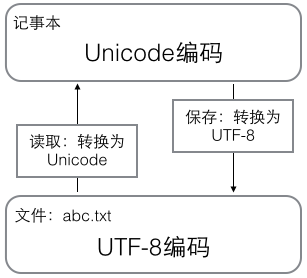

# Encoding - 编码

编码是为了解决计算机无法处理除二进制数字以外的数据而出现的。如果我们都将需要的数据转换为二进制数字交由计算机计算和处理，那么无疑将过于复杂。但我们可以将一段特殊组合的二进制数固定对应一个字符，那么就可以以字符的形式与计算机交互。

我们从 ASCII - Unicode - UTF-8 的顺序来介绍这几种编码。

## ASCII 编码

> **ASCII**（发音： [/ˈæski/](https://zh.wikipedia.org/wiki/Help:英語國際音標) [*ASS-kee*](https://zh.wikipedia.org/wiki/Wikipedia:發音重拼)[[1\]](https://zh.wikipedia.org/wiki/ASCII#cite_note-1)，**A**merican **S**tandard **C**ode for **I**nformation **I**nterchange，**美国信息交换标准代码**）是基于[拉丁字母](https://zh.wikipedia.org/wiki/拉丁字母)的一套[电脑](https://zh.wikipedia.org/wiki/电脑)[编码](https://zh.wikipedia.org/wiki/编码)系统。它主要用于显示[现代英语](https://zh.wikipedia.org/wiki/現代英語)，而其扩展版本[延伸美国标准信息交换码](https://zh.wikipedia.org/wiki/EASCII)则可以部分支持其他[西欧](https://zh.wikipedia.org/wiki/西欧)[语言](https://zh.wikipedia.org/wiki/语言)，并等同于国际标准**[ISO/IEC 646](https://zh.wikipedia.org/wiki/ISO/IEC_646)**。

由于大家都耳熟能详的第一台计算机 ENIAC 于 1946 年出生在美国，因此最早的（应该是最早）的编码表（字符集标准）也是出生于美国，他就是 ASCII 编码，通过一个字节的数据来表示一个字符。

但是缺点也很明显。

> ASCII的局限在于只能显示26个基本拉丁字母、阿拉伯数字和英式标点符号，因此只能用于显示现代美国英语（且处理naïve、café、élite等[外来语](https://zh.wikipedia.org/wiki/外來語)时，必须去除[附加符号](https://zh.wikipedia.org/wiki/附加符號)）。

这是因为 1byte 仅储存 8bit 数据，共能组合出 256 种结果，也就是共能表示256个字符，难以表示英文字母以外的字符。

## Unicode 编码

> **Unicode**，[联盟](https://zh.wikipedia.org/wiki/統一碼聯盟)官方中文名称为**统一码**[[1\]](https://zh.wikipedia.org/wiki/Unicode#cite_note-1)，是[计算机科学](https://zh.wikipedia.org/wiki/電腦科學)领域的业界标准。它整理、编码了世界上大部分的[文字系统](https://zh.wikipedia.org/wiki/文字系統)，使得电脑可以用更为简单的方式来呈现和处理文字。

> uni前缀的意思是源于拉丁语unus意为一。

与这些单词 unify 统一，unison 一致，unity 团结一致 词根相同，Unicode为统一码的意思。

随着世界的进步，计算机的普及使得越来越多的国家得以使用计算机。语言不同又使不同的国家推出了不同的编码表（字符集标准），而 Unicode 的出现就是为了解决这种编码不同而让人烦恼的问题的。

> 各种编码的字符互不兼容，相互之间的通信可能由于编码的不同，而导致对方看到的是乱码，这就如中国历史中的大秦统一文字和度量单位之前的华夏文明一样，语言不通、货币不通，交流困难。

Unicode 实现了对各种编码的统一，其使用更长的字节数来表示一个字符，并且一直都在进行不断的更新。

> （第十万个字符在2005年获采纳）
>
> Unicode至今仍在不断增修，每个新版本都加入更多新的字符。

其设计原则和编码方式此处不作深入理解。// TODO

## UTF-8 编码

> **UTF-8**（**8-bit Unicode Transformation Format**）是一种针对[Unicode](https://zh.wikipedia.org/wiki/Unicode)的可变长度[字符编码](https://zh.wikipedia.org/wiki/字元編碼)，也是一种[前缀码](https://zh.wikipedia.org/wiki/前缀码)。它可以用一至四个字节对Unicode字符集中的所有有效编码点进行编码，属于[Unicode](https://zh.wikipedia.org/wiki/Unicode)标准的一部分。

UTF的特点是可变长度，英文字母会被编码成一个字节，汉字通常是三个字节。在Unicode中，**如果**使用六个字节表示一个较长的字符，那么其他字符也需要使用六个字节来表示。这**大抵**是认为当字符编码长度不统一时，计算机会误读。但 UTF-8 却解决了这个问题，并且当然的，使用非固定长度来编码字符节省了空间。

我认为是前缀码这种结构让 UTF-8 实现了不同长度可以正确读出字符的功能。

（哈夫曼树）// TODO

**在我的理解中，**前缀编码通过整个字符集的字符的二进制数字无重复前缀以达到不同字符不同长度的功能。

> 前缀编码 是指对字符集进行编码时，要求字符集中任一字符的编码都不是其它字符的编码的前缀，例如：设有abcd需要编码表示（其中，a=0、b=10、c=110、d=11,则110的前缀表示的可以是c或者是d跟a，出现这种情况是因为d的前缀11与c的前缀110有重合部分，这个是关键。）
>
> 用构造哈夫曼树的过程生成的二进制前缀编码。哈夫曼树是一类带权路径长度最短的树。

当我们使用 Windows 的记事本编辑文本的时候，此时文本读入计算机内存，统一使用 Unicode 编码，当我们保存到硬盘或传输时，就转换为 UTF-8 编码。

## GB2312 GBK 和 GB18030

> **GB2312** 是对 **ASCII** 的中文扩展。
>
> 但是中国的汉字太多了，后来还是不够用，于是干脆不再要求低字节一定是127号之后的内码，只要第一个字节是大于127就固定表示这是一个汉字的开始，不管后面跟的是不是 扩展字符集里的内容。结果扩展之后的编码方案被称为 **GBK** 标准，GBK 包括了 GB2312 的所有内容，同时又增加了近20000个新的汉字（包括繁体字）和符号。后来少数民族也要用电脑了，于是我们再扩展，又加了几千个新的少数民族的字，**GBK** 扩成了 **GB18030**。从此之后，中华民族的文化就可以在计算机时代中传承了。

实际上GB18030还支持日韩及繁体汉字，除此之外**个人认为**没有需要特别强调的部分，故直接引用。

Refrence：

[编码与解码的历史发展](https://www.modb.pro/db/156942)

[包容整个世界的编码发展史](https://zhuanlan.zhihu.com/p/108695825)

[Unicode字符集的由来](https://www.cnblogs.com/wfsovereign/p/12081196.html)

[ASCII - 维基百科](https://zh.wikipedia.org/wiki/ASCII)

[Unicode - 维基百科](https://zh.wikipedia.org/wiki/Unicode)

[UTF-8 - 维基百科](https://zh.wikipedia.org/wiki/UTF-8#%E6%AD%B7%E5%8F%B2)

[前缀编码 - 百度百科](https://baike.baidu.com/item/%E5%89%8D%E7%BC%80%E7%BC%96%E7%A0%81/5179657)

[编码格式简介（ANSI、GBK、GB2312、UTF-8、GB18030和 UNICODE）](https://blog.csdn.net/ldanduo/article/details/8203532/)

[ANSI - 百度百科](https://baike.baidu.com/item/ANSI/10401940)