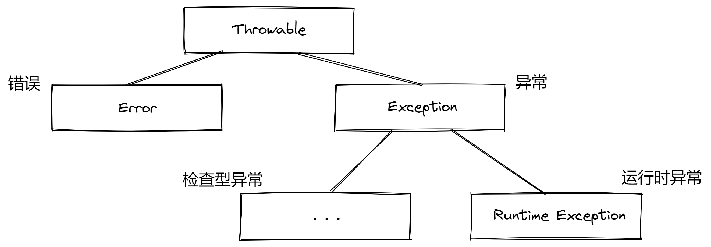
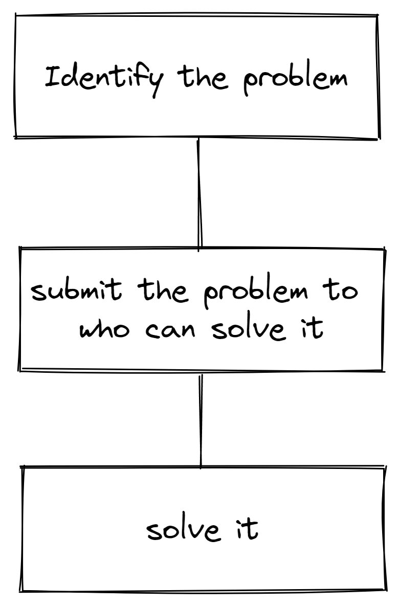

# Exception - 异常

异常处理是 Java 错误捕获的手段。显然，当遇到一个致命问题时，报告问题并保存数据比什么都不做就直接崩溃要好太多了。异常处理就是 Java 中当知道可能遇到问题时，指定如何处理和在哪处理这个问题的机制。

> 人们在遇到错误时会感觉很不爽。如果由于程序的错误或一些外部环境的影响，导致用户在运行程序期间做的所有工作统统丢失，这个用户就有可能再也不会使用这个程序了。为了尽量避免这类事情的发生，至少应该做到以下几点：
>
> - 向用户通知错误；
> - 保存所有的工作；
> - 允许用户妥善地退出程序。
>
> 对于异常情况，例如，可能造成程序崩溃的错误输入，Java 使用了一种称为异常处理（ exception handing ）的错误捕获机制。

## 1 异常分类

不是所有的错误在 Java 中都是异常，所有错误在 Java 中可以分为以下三种：

1. 检查型异常（Checked Excption）

   检查型异常一般是对非理想状态的描述，这并不是一个严重的问题，然而需要对他进行处理。例如读取了一个不存在的文件，文件不存在是一个非理想的状态，那么我们仅需要向用户报告这个错误，然后停止读取即可。

2. 运行时异常（Runtime Excption）

   运行时异常与检查型异常相反，它在最初程序员编写的时候就可以被避免，这种问题在任何时候都不能被允许（可以理解为一个逻辑性问题）。例如在程序的某处使用了 null（也就是空指针异常问题），或是对数值进行了除 0 操作。

3. 错误（Error）

   错误并不是一种异常，更多时候是程序员无法控制的因素。例如运行程序时内存溢出，这显然是程序员无法控制的。

我们可以简单的总结：

> ”如果出现 RuntimeException 异常，那么就一定是你的问题“，这个规则很有道理。应该通过检测数组下标是否越界来避免 ArrayIndexOutOfBoundsException 异常；应该在使用变量之前通过检测它是否为 null 来杜绝 NullPointerException 异常的发生。
>
> 如何处理不存在的文件呢？难道不能先检查文件是否存在再打开它吗？嗯，这个文件有可能在你检查它是否存在之后立即被删除了。因此，”是否存在“ 取决于环境，而不只是取决于你的代码。

而 Java 语言规范将继承 Error 类或 RuntimeException 类的所有异常称为非检查型（ Unchecked ）异常，所有其它的异常称为检查型（ Checked ）异常，这是一个很重要的概念，在后面还会经常用到。

## 2 继承关系

如下图所示：



所有异常全部继承 Throwable 类，这其中包括 Error 和 Exception。运行时异常和检查异常则均继承 Exception 类。

## 3 处理异常

当遇到一个可能会出现问题的地方时，需要抛出异常。放到一般生活中，解决问题首先需要认识问题，然后交给能处理它的人手上，最终解决这个问题。



1. 认识问题，声明一个指定类型的异常的意义就是表明了异常的类型。
2. 交给能够处理该问题的处理者手中，抛出的 ”抛“ 字即表示了此处并不处理产生该异常的后果，而是让调用该类或方法的上级类或方法手中处理。
3. 实际处理问题，最终我们需要使用一个 try … catch … 块来处理它。

当调用了一个声明了异常的方法（或实例化一个声明了异常的类）时，就需要处理它，或在调用本方法的更上级的地方处理它。

### 3. 1 抛出异常

这个过程放在 Java 中也同样适用，我们使用 `throws` 关键字抛出异常：

```java
public FileInputStream(String name) throws FileNotFoundException
```

这是文件输入流方法的定义，它通过声明了一个异常 FileNotFoundException 来声明该方法可能会发生一个无法找到文件的问题（即它可能会抛出一个 FileNotFoundException 异常以寻求上级调用者来处理它）。

或者是使用 `throw` 关键字来在代码的任何位置抛出一个由你指定的异常（包括自定义异常，稍后会介绍自定义异常类的相关内容）。

```java
if(!isCorrect) { // 这是一个没有上文的例子 故不太严谨
    throw new FileFormatException;
}
```

上例，这样你就可以抛出一个文件格式异常，并要求上级调用者处理他或再抛出。

### 3. 2 捕获异常

当需要处理异常时，需要使用 try - catch 块，语法如下：

```java
try {
    ... // 可能会抛出异常的代码块
} catch(Exception e) { // 异常类型
    ... // 处理异常的代码块
}
```

当针对多个不同类型的异常采用不同的处理策略时，可以使用多个代码块：

```java
try {
    ...
} catch(IOException e) { // 就像if语句一样拆分
    ...
} catch(AWTException e) {
    ...
} catch(TimeoutException e) {
    ...
}
```

有时会遇到无论代码是否出现异常都必须要处理的情况，例如使用IO流的时候需要在最后关闭流。这种情况就需要使用 finally 代码块，finally 代码块一般存放的是善后性质的代码。

下面是一个简单的例子（没有什么实际用处）：

```java
URL url = null;
OutputStream os = null;
try {
    url = new URL("https://www.baidu.com");
    HttpURLConnection connection = (HttpURLConnection) url.openConnection();
    os = connection.getOutputStream();
} catch (Exception e) {
    e.printStackTrace();
} finally { // 当然 你也可以使用嵌套try-catch块
    try {
        if(os != null) {
            os.close();
        }
    } catch (Exception e) {
        e.printStackTrace();
    }
}
```

## 4 自定义异常

> 你的代码可能会遇到任何标准异常都无法描述清楚的问题。在这种情况下，创建自己的异常类就是一件顺理成章的事情了。我们需要做的只是定义一个派生于 Exception 的类，或者派生于 Exception 的某个子类，如 IOException。习惯做法是，自定义的这个类应该包含两个构造器，一个是默认的构造器，另一个是包含详细描述信息的构造器（超类 Throwable 的 toString 方法会返回一个字符串，其中包含这个详细信息，这在调试中非常有用）

这段来自于《 Java 核心技术 》的文字描述已经清晰到无需任何形式再解释一遍自定义异常类的流程了。


TODO

1. 异常的再抛出和异常链
2. try with resource
3. 堆栈轨迹
4. 断言