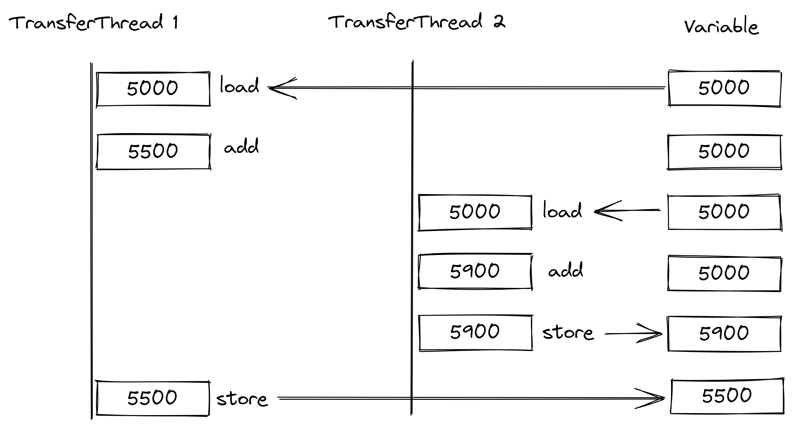

# Multithreading - 多线程

## 1 浅谈线程

**进程和线程分别是什么？**程序是一组预先编制好的代码，当交给系统执行时需要分配资源（内存空间等）以运行，运行中的程序称之为进程；线程本身同样是一组代码（对 CPU 来说是一组指令），线程间共享同一个进程的资源（意指代码可以访问进程资源并读写），线程间互相并行执行指令。

**如何并行？**现如今 CPU 大抵都为多核心，通过把线程分配到不同的核心，以达到每个核心同时各自处理不同的内容的效果。若没有那么多（或空闲的）核心可供使用，则将时间进行切片，每个时间切片的实际时间长度都极短，CPU 在不同时间切片切换到不同的线程执行指令。

**线程如何切换？**CPU 在切换线程前会将当前线程的执行状态（执行到的指令位置等）保存下来（即保存现场），然后切换到其它线程读取以前保存下来的状态继续执行，以此类推。

并发和并行

线程调度：分时 and 抢占（java是抢占）

## 2 线程的生命周期

线程从创建到销毁共经历六个阶段（ Java 中的线程生命周期 ）：

1. 初始化状态（ NEW 新建 ）

   即为创建了线程但没有执行的状态。

2. 可执行状态（ RUNNABLE 可运行 ）

   可执行状态是指线程处于正在执行代码中的状态。（可以理解为运行状态）

3. 阻塞状态 （ BLOCKED 阻塞 ）

   TODO

4. 无时限等待状态（ WAITING 等待 ）

   TODO

5. 有时限等待状态（ TIMED_WAITING 计时等待 ）

   该状态可以通过调用 Thread 类的静态方法 sleep() 达到。 

6. 终止状态 （ TERMINATED 终止 ）

   当 run() 中的代码执行完毕，线程就会达到这个状态。

尽管网上和 《 Java 核心技术 》 中有各式的图解六种线程状态，但廖雪峰网站中的示意图仍从中脱颖而出：

```ascii
         ┌─────────────┐
         │     New     │
         └─────────────┘
                │
                ▼
┌ ─ ─ ─ ─ ─ ─ ─ ─ ─ ─ ─ ─ ─ ─ ─ ┐
 ┌─────────────┐ ┌─────────────┐
││  Runnable   │ │   Blocked   ││
 └─────────────┘ └─────────────┘
│┌─────────────┐ ┌─────────────┐│
 │   Waiting   │ │Timed Waiting│
│└─────────────┘ └─────────────┘│
 ─ ─ ─ ─ ─ ─ ─ ─ ─ ─ ─ ─ ─ ─ ─ ─
                │
                ▼
         ┌─────────────┐
         │ Terminated  │
         └─────────────┘
```

实际上，Java 规范没有将运行作为一种单独的状态。当调用 start 方法，线程就处于可执行状态，这意味着正在执行的线程也处于可执行状态。需要注意的是，

> 线程调度的细节依赖于操作系统提供的服务。
>
> . . .
>
> 现在所有的桌面以及服务器操作系统都使用抢占式调度。但是，像手机这样的小型设备可能使用协作式调度。在这样的设备中，一个线程只有在调用 yield 方法或者被阻塞或等待时才失去控制权。

## 3 创建线程

创建线程有三种方式：

1. 继承 Thread 类
2. 实现 Runable 接口
3. 实现 Callable 接口 TODO

使用继承 Thread 和实现 Runnable 的实际做法差异并不大，他们都要求重写 run 方法。但是为避免 Java OOP 的单继承局限性，我们最好还是采用第二种方式。

对于继承了 Thread 类的方式，开始线程的方法为直接调用该类的 start 方法。

```java
public class MyThread extends Thread {
    
    @Override
    public void run() {
        . . . // do sth.
    }
    
}

. . . 
    
public class Test {
    
    public static void main(String[] args) {
        new MyThread().start();
    }
    
}
```

而对于实现了 Runnable 接口的类的方式，开始线程的方法为 new 一个 Thread 类的对象，然后将该 Runnable 接口的实现类的对象作为参数传入 Thread 类的对象的构造方法中，然后再调用 Thread 类的对象的 start 方法。

（下例简写为匿名内部类的形式，你应该知道如何将它转换为一般类的写法）

```java
public class Test {
    
    public static void main(String[] args) {
        new Thread(new Runnable() {
            @Override
            public void run() {
                . . . // do sth.
            }
        }).start();
    }
    
}
```

## 4 线程同步

### 4. 1 竞态条件和临界区

多个线程之间有时需要对同一块数据进行操作。如果线程间竞争资源时，如果对资源的访问顺序敏感，则存在竞态条件，导致竞态条件发生的代码区称为临界区。竞态条件会产生预期之外的结果，假设现有两条线程，Thread 1 为 Variable 加 500，另外一个线程 Thread 2 为 Variable 加 900，两个线程同时启动，可能会出现的情况如下图所示：



在 CPU 中，一次简单的加法并不是一条指令即可完成的操作（即不具有原子性），如果在线程 A 已经从内存完成了读取数据时，线程 B 对数据进行了更新，A 所持有的运算数无疑就会过时，接下来 A 所做的运算就会出错。

为避免竞态条件的出现，解决方法也相当明显。以上图为例，解决问题的关键在于如何保证两条线程中最多只有一条线程正在进行运算。也就是让操作内存的这个环节在多个线程间串行执行。

### 4. 2 防止并发访问

为解决竞态条件的问题，当一个线程在执行临界区代码时就禁止其它线程执行这段代码，这显然是必要的措施。

> 有两种机制可防止并发访问代码块。Java 语言提供了一个 synchronized 关键字来达到这一目的，另外 Java 5 引入了 ReetrantLock 类。synchronized 关键字会自动提供一个锁以及相关的 “ 条件 ” ，对于大多数需要显式锁的情况，这种机制功能很强大，也很便利。

#### 4. 2. 1  synchronized（同步）

##### 4. 2. 1. 1  synchronized 代码块

使用 synchronized 代码块：

```java
synchronized(lock) { // lock is an Object
    . . . // do sth.
}
```

该代码块的作用是，在首个执行该代码块的线程将取走锁，在执行完代码块后。这意味着所有**该对象**的不同线程在即将执行该代码块中的代码时，都发现锁已经被人取走了，就会等待直到锁归还。

lock 一般是一个 Object 类型的对象。

##### 4. 2. 1. 2  synchronized 方法

使用 synchronized 方法：

```java
public synchronized void methodName() {
    . . . // do sth.
}
```

与其代码块相似的，synchronized 方法会在进入方法时取锁，在执行完方法体中的代码时归还锁。但不需要手动提供一个 Object 对象作为锁。

值得注意的是：同一个线程允许多次取锁。即同一个线程可以在已经取走对象 A 中一个方法的锁后，再次取对象 A 中另一个方法的锁，当所有锁全部归还时，才允许其它线程进行执行。

##### 4. 2. 1. 3  wait 方法 和 notify 方法（线程通信）

当在一个同步方法中使用 wait 方法可以使线程进入无时限等待状态，而使用 notify 方法可以使线程重新回到可执行状态。

值得注意的是：因为同步方法取得的锁是 this，所以只能调用 this 的 wait 方法进入等待状态。

> 这里的关键是：`wait()`方法必须在当前获取的锁对象上调用，这里获取的是`this`锁，因此调用`this.wait()`。

这是廖雪峰官方网站中的解释，更加清晰。

#### 4. 2. 2 锁对象

锁对象是指在对类内声明一个锁对象，在临界区代码前调用该对象的 lock 方法，在临界区代码之后调用该对象的 unlock 方法。这会使某一个线程在执行临界区代码时禁止其它线程执行临界区代码。

TODO 

线程死锁

锁对象

- ReentrantLock 重入锁 比 synchronized 更安全
  - Condition 解决线程通信
- ReadWriteLock 读写锁 对于并发读的效率提升很高 - 悲观锁
- StampedLock 乐观锁

守护线程

线程池