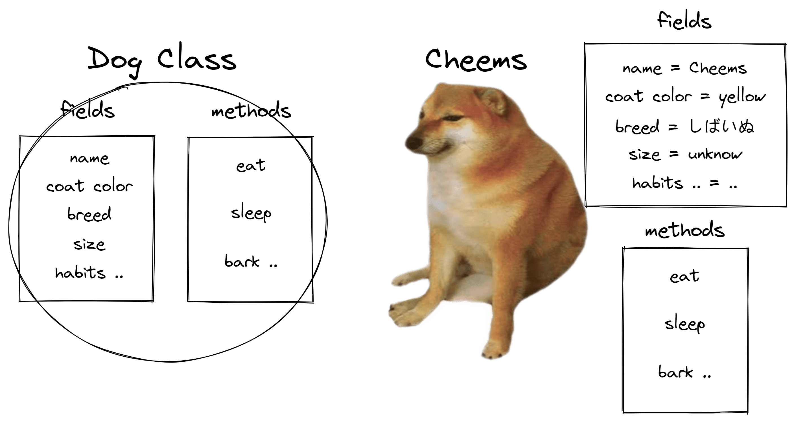

# OOP - 面向对象

## 1 理解类和对象

### 1. 1 浅谈面向对象

面向对象是一种实现程序的方式的思想。

程序是是解决需求的产物，也就是说程序是若干功能的集合。对于这些功能，最简单的实现方式就是对于每个功能逐一编写对应的代码，放到一起。

但是我们能意识到一些问题：如果这些功能之间交互很多，那么由于各个功能互相需要的数据不尽相同，变量调用和函数操作错综复杂，就会导致整个程序的优化和维护变得异常困难。

为解决这个问题，我们可以考虑一种新的，更加易于组织函数和字段、理清代码之间的关系的思想来作为编写代码的原则，这个原则在 Java 中就是面向对象。面向对象中有两个核心概念：**类和对象**。我们首先理解对象，进而引出类的概念加以解释。

对象不是一种计算机专有的名词，从更根本的角度来思考对象的意义更有助于理解面向对象的思想：哲学中的对象，又称客体，它是任何可以被思考或讨论的事物。因此任何一个事物我们都可以称作为对象。

我们可以将具有相同特征的对象进行归类，例如 " 狗 " 是一种把对象分类之后的概念。因此如果我们想凭空臆造一只（一般意义的）狗，那么这条狗无论多么与众不同，这条狗一定有 " 狗 " 所拥有的特征。

我们可以举一个具体的例子来理解类和对象。" Cheems 是一条狗 " ，" Cheems " 相对于 " 狗 " 来说是具体的对象，而 " 狗 " 是较为宽泛的概念（他意指了一类对象），因此我们说，" Cheems " 是 " 狗 " 类的一个对象。而具体的对象和分类的区别在于：具体的事物的特征是可描述的，如 Cheems 的名字是它的一个特征，而它的名字这种特征即为 Cheems ，Cheems 的毛色是它的一个特征，而它的毛色这种特征即为黄色；分类的特征仅是一种概念，不能具体被描述，如狗可能会有名字，但是我们不能说狗这一类动物的名字都为 Cheems 。

属性（也称字段）或方法即是一类对象所共有的特征（一个静态的特征为属性，一个动态的特征为方法。也可以说动词就对应着方法，但名词不都是属性）（《 Java 核心技术 》中写道：" 识别一个类的一个简单经验是在分析问题的过程中寻找名词，而方法对应着动词 "）。我们从上例中能简单看出类即是一种事物抽象的概念，而对象即是从特定种类事物概念中具象出来的东西。



这为什么是在 Java 程序中最核心的思想？如果我们在程序中需要一个窗体，那么我们创建一个窗体对象；如果我们需要一个文本，那就创建一个文本对象，然后在窗体对象中调用一个为窗体添加组件的方法（如果不明白方法是什么，可以暂且理解为函数），将文本对象作为参数传进去。功能就这样实现了，代码的逻辑相当符合人类思考的方式。

### 1. 2 字段

对象由字段和方法组成，这一节简要介绍字段相关较重要的部分。

类中的字段应当进行显式的初始化，虽然类中方法外的字段不进行初始化会被赋予一个默认值。我们可以通过在构造方法（将在之后详细讨论）中进行初始化或是在类中的声明后立即赋值，也可以通过初始化块进行。

```java
private String name;

{
    name = "iamqwq"; // init block
}
```

### 1. 3 方法

对象由字段和方法组成，这一节简要介绍方法相关较重要的部分。

> 首先回顾一下在程序设计语言中关于如何将参数传递给方法（或函数）的一些专业术语。按值调用（call by value）表示方法接收的是调用者提供的值。而按引用调用（call by reference）表示方法接收的是调用者提供的变量地址。方法可以修改按引用传递的变量的值，而不能修改按值传递的变量的值。

> Java 程序设计语言总是采用按值调用。也就是说，方法得到的是所有参数值的一个副本。具体来讲，方法不能修改传递给它的任何参数变量的内容。

另外，如果 Person 类中拥有一个方法 modAge 如下定义：

```java
public void modAge(int age) {
	. . . 
}
```

modAge 方法可以将 Person 对象的年龄修改为参数的年龄。假设我们使用 aPerson.modAge(10); 来修改对象 aPerson 的年龄，modAge 的参数有两个，第一个参数称为隐式（ implicit ）参数，即是方法前的 Person 类型对象。第二个参数是位于方法名后括号中的值，这是一个显式（explicit）参数。在任何一个方法中，关键字 this 指示隐式参数，如下例：

```java
public void modAge(int age) {
    // "this.age" means Object's field and "age" is the method's parameter
    this.age = age;
}
```

如果需要定义一个未知参数数量的方法，我的意思是说，参数数量可能变化，那么就需要用到可变参数方法。

```java
public void printMsg(String ... msg) {
    for(String m : msg) {
        System.out.println(m);
    }
}
```

值得注意的是，" … " 是 Java 语句中的一部分，当我们在入口方法的位置调用它时就可以传入若干个参数，如：printMsg("hello", "this", "is", "iamqwq") 这样调用。

它的输出结果即为：

hello

this

is

iamqwq

printMsg("hello", "this", "is", "iamqwq") 实际上向方法中传递了一个 String 类型的数组，所以可以通过 foreach 来遍历它。

## 2 构造对象

如果想构造一个 Test 类的对象，我们需要使用 new Test(); 的形式来进行构造（但这个对象没有被保存到任何一个对象变量中）。从上例形式中我们可以观察得到，如果需要构造一个指定类的对象，就需要在对应类的构造器前使用 new 关键字。

### 2. 1 构造器

从类中具象化（我们通常把这个过程称为实例化）出一个对象时，通常要初始化一些属性。实现初始化对象的方法就是构造器。

构造器需要和类同名，同时可以有参数，根据调用构造器时传入的参数来初始化对象。

```java
public class Employee {
    int salary;
    public Employee() {
        this.salary = 0;
    }
}
```

### 2. 2 重载

我们还可以通过在类中编写多个构造器来达到使用不同参数分别使用不同的初始化方法。

```java
public class Employee {
    int salary;
    public Employee() {
        this(0);
    }
    public Emloyee(int salary) {
        this.salary = salary;
    }
}
```

上例无参构造器中的 this 可以在构造器中调用另外一个构造器。这样这个类在实例化的时候，构造器如果无参，则会实例化一个 salary 为 0 的 Emloyee 对象；如果有一个 int 型的参数，则会实例化一个 salary 该参数值的 Emplyee 对象。

## 3 封装

封装属性就是将类中的属性使用 private 修饰，用 public 方法来修改 private 的属性。

```java
import java.util.Objects;

public class Item {
    
    private String name;
    private double price;
    
    public Item() {
        this("unknow", 0);
    }
    public Item(String name, double price) {
        this.setName(name);
        this.setPrice(price);
    }
    
    public String getName() {
        return this.name;
    }
    public void setName(String name) {
        this.name = Objects.requireNonNullElse(name, "unknow");
    }
    public double getPrice() {
        return this.price;
    }
    public void setPrice(double price) {
        if(price >= 0) {
            this.price = price;
        } else {
            this.price = 0;
        }
    }
    
}
```

我们将这种 getSomeField 和 setSomeField 的方法分别称作 getter 和 setter（访问器和修改器方法）。使用 getter 和 setter 有以下好处：我们可以在 getter 和 setter 方法中添加其他代码，这意味着我们可以记录属性的改动（即日志）；如果格式发生改变，我们可以直接修改 getter 和 setter 方法，因为他们负责底层实现，而不需要改动其他调用他的方法；我们还可以在其中增加数据校验，就同上例一样。

上例使用的 Objects 工具类中的 requireNonNullElse 方法是 Java 9 之后的版本提供的。requireNonNullElse 方法在发现 name 参数为 null 时将其转换为 "unknow"。

> 如果对 null 值应用一个方法，会产生一个 NullPointerException 异常。
>
> ```java
> LocalDate birthday = null;
> String s = birthday.toString(); // NullPointerException
> ```
>
> 这是一个很严重的错误，类似于 "索引越界" 异常。如果你的程序没有 "捕获" 异常，程序就会终止。正常情况下，程序并不捕获这些异常，而是依赖于程序从一开始就不要带来异常。
>
> . . .
>
> 对此（可能为 null 的字段或对象）有两种解决办法。"宽容型" 方法是把 null 参数转换为一个适当的非 null 值：
>
> ```java
> if (n == null) {
>     name = "unknow";
> } else {
>     name = n;
> }
> ```
>
> 在 Java 9 中，Objects 类对此提供了一个便利方法：
>
> ```java
> public Employee(String n, double s, int year, int month, int day) {
>     name = Objects.requireNonNullElse(n, "unknow");
>     . . .
> }
> ```
>
> "严格型" 方法则是干脆拒绝 null 参数：
>
> ```java
> public Employee(String n, double s, int year, int month, int day) {
>     Objects.requireNonNull(n, "The name cannot be null");
>     name = n;
>     . . .
> }
> ```
>
> 如果有人用一个 null 名字构造了一个 Emloyee 对象，就会产生 NullPointerException 异常。乍看上去这种做法好像不太有用。不过这种方法有两个好处：
>
> 1. 异常报告会提供这个问题的描述。
> 2. 异常报告会准确地指出问题所在的位置，否则 NullPointerException 异常可能在其他地方出现，而很难追踪到真正导致问题的这个构造器参数。

封装可以隐藏实现的细节。方法的使用者仅需知道他可以完成什么功能而不用去关心它是怎么实现的，这让代码都耦合性降低。

> 绝大多数方法都被设计为公共的，但在某些特殊情况下，将方法设计为私有可能很有用。

如果一个功能希望被分为很多个方法去辅助实现，那么它同样该被设计为 private，这样做的目的同样是隐藏实现的细节。

## 4 继承

### 4. 1 子类和超类

继承是 Java 中较重要的概念，一个类可以通过在类后 extends 某个类名来表示该类继承某个类，被继承的类则称为超类（子类和超类的概念也称作派生类和基类或父类和子类）。

子类继承了超类的功能，而又扩展了超类功能。子类与超类是 is-a 的关系，子类（如学生）一定属于超类（如人类），从这个角度来说，超类的属性和功能更具一般性。

子类拥有超类的所有字段和方法，并且可以增加字段和方法，而且可以覆盖（重写）超类的方法。

### 4. 2 重写

很明显，子类直接使用继承到的方法是不合适的（如经理为员工的子类，经理继承员工类，但普通员工的薪水计算方式与经理薪水计算方式必然会有些许不同）。

> 为此，需要提供一个新的方法来覆盖（override）超类中的这个方法。

当需要重写一个方法时，应当在子类中定义与超类中签名相同的方法（方法名和其参数列表是方法的签名，返回类型不是签名的一部分，但是重写时需要保证返回类型的兼容性，即返回类型可以是超类方法的返回类型或他的子类）。

超类代码：

```java
import java.util.Objects;

public class Person {

    // suppose that person have only this two fields
    // fields
    private int age;
    private String name;

    // constructors
    public Person() {
        this(0, "unknow");
    }
    public Person(int age, String name) {
        this.setAge(age);
        this.setName(name);
    }

    // getters and setters
    public int getAge() {
        return age;
    }
    public void setAge(int age) {
        this.age = age;
    }
    public String getName() {
        return name;
    }
    public void setName(String name) {
        this.name = Objects.requireNonNullElse(name, "unknow");
    }

    // methods
    public void printName() {
        System.out.println(this.getName());
    }

}
```

子类代码：

```java
import java.util.Objects;

public class Student extends Person {

    // fields
    private String school;

    // constructors
    public Student() {
        this(0, "unknow", "unknow");
    }
    public Student(int age, String name, String school) {
        super.setAge(age);
        super.setName(name);
        this.setSchool(school);
    }

    // getters and setters
    public String getSchool() {
        return school;
    }
    public void setSchool(String school) {
        this.school = Objects.requireNonNullElse(school, "unknow");
    }

    // methods
    @Override
    public void printName() {
        System.out.println(this.getSchool() + ":" + this.getName());
    }

}
```

super.setAge(age); 指的就是要执行超类中的 setAge 方法，而如果使用 super(); 则代表要使用超类的构造器，需要注意的是，如果没有在子类中显式的调用超类的构造器，则会调用超类的无参构造器。

在入口方法中执行 new Student(18, "iamqwq", "幻想乡").printName(); 后就会在终端中输出 幻想乡:iamqwq。

### 4. 3 多态和动态绑定

多态从字义上来看即为多种形态。子类的每个对象也是超类的对象，这就意味着一个对象变量可以引用多个实际类型，一个超类的对象变量也可以引用子类的对象。

在上一小节代码的基础上，如果在入口方法中有这样一段代码：

```java
Person[] people = new Person[2];
people[0] = new Person(33, "Sam");
people[1] = new Student(16, "Cheems", "No.1 Secondary school");
for(Person p : people) {
    p.printName();
}
```

终端中会输出：

Sam
No.1 Secondary school:Cheems

可见，Student 与 Person 对象都可以存入 Person 类型的数组中，这即是多态的体现。但我们需要注意，Student 对象可以存入一个 Person 类型的数组，但 Person 对象无法存入 Student 类型的数组，这就是承诺过多。一个 Student（学生）必定是一个 Person（人），但你没有办法保证所有 Person（人）都是 Student（学生）。当你试图强制转换 Person 对象为一个 Student 类型时，编译器同样会注意到你的承诺不符而报错。

更显然的，在实际执行具体方法时，对象变量又可以正确识别出执行的方法属于哪个类，不会因为超类与子类存在同名方法而出现错误；在运行时自动选择适当的方法，这就是动态绑定。虚拟机预先为每个类计算了一个方法表，当需要执行某个方法的时候，虚拟机就会查找这张表，以之前的代码为例，这张表应该是：

Person：

​	getAge() - > Person.getAge()

​	setAge() - > Person.setAge()

​	getName() - > Person.getName()

​	setName() - > Person.setName()

​	printName() - > Person.printName()

> 实际上，上面列出的方法还不完整，稍等会看到 Person 类有一个超类 Object，Person 类从这个超类中还继承了大量方法，在此，我们略去了 Object 的方法。
>
> Student 方法表稍微有些不同。其中有四个方法是继承而来的，一个方法是重新定义的。

Student：

​	getAge() - > Person.getAge()

​	setAge() - > Person.setAge()

​	getName() - > Person.getName()

​	setName() - > Person.setName()

​	printName() - > Student.printName()

解析 p.printName() 的过程为：

1. 首先查找 p 实际类型的方法表。
2. 查找定义了 printName 签名的类。
3. 调用与该类的签名相同的方法。

多态和动态绑定让代码的可复用性高，无须修改既有代码就可以对程序进行扩展。

### 4. 4 阻止继承和重写 TODO

使用 final 关键字修饰类可以阻止类被继承，使用 final 关键字修饰方法可以阻止方法被重写。阻止继承和重写一般是用于防止被改变语义（如 Calendar 类的 getTime 方法和 setTime 方法）。

### 4. 5 抽象类 TODO

抽象类只将其作为派生其它类的基类，因此他很上层，更具备一般性。抽象类前被 abstract 修饰，抽象类不能被实例化，但可以引用非抽象的子类对象。抽象类中可以将方法同样以 abstruct 修饰从而成为抽象方法，让继承他的子类来实现抽象方法。

### 4. 6 所有类的超类

#### 4. 6. 1 简述 Object 类

所有的类在没有显式的继承自某一个类的时候，就会隐式的继承 Object 类，即 Object 为所有类的超类。这也意味着任何类都从 Object 类中继承了一些方法，这些方法具有普遍性，可以用以描述任何对象（有时需要重写）。

Object 类可以引用任何类的对象，但具体操作需要明确具体类型并进行相应的强制类型转换（如 Student 是 Object 类的子类，可以使用 Object stu = new Student(); 来引用 Student 类对象，但如果需要执行 Student 类对象具体拥有的方法则需要将 stu 对象强制转换回 Student 类型）。

理解了上文描述之后，很明显，在 Java 中所有的类都直接或间接继承 Object 类。我想，这大概就是广为人知的 " 一切皆为对象 " 的含义。（在 Java 中只有基本类型不是对象，即 byte、short、int、long、float、double、boolean、char）

#### 4. 6. 2  equals 方法

Object 类提供了 equals 方法以让我们判断隐式参数对象和显式参数对象是否相同。逻辑运算中经常用到 == 运算符，在对象的比较中也同样可以使用 == 运算符，但 == 运算符用于比较对象时有一定的局限性：他并不是在比较左右两边对象中属性的值是否相同，而是在比较左右两边对象变量引用的地址是否相同。

如果使用 == 运算符System.out.println(str1.equals(str3));比较 str1 与 str3：

```java
String str1 = "hello";
String str2 = "hello";
String str3 = new String("hello");

System.out.println(str1 == str2);
System.out.println(str1 == str3);
```

在终端中输出的结果是：

true

false

这是因为 str1 与 str2 都引用了存有 hello 这个值的地址，而 new String("hello"); 这种写法则开辟了一个新的空间以存放值，在 == 运算符的按引用比较时就会出现逻辑上的谬误。我们大部分时间想要的效果是按值比较，即判断两个对象中的类型是否一致，属性值是否相同等。

如果使用 equals 方法比较 str1 与 str3：

```java
. . .
System.out.println(str1.equals(str3));
```

在终端中输出的结果是：

true

我们在 Object 类中查看 equals 方法的实现细节：

```java
public boolean equals(Object obj) {
        return this == obj;
}
```

可见，该方法并没有采用按值比较来判断并返回结果，但在 str1 与 str3 的比较中却可以正确输出结果。这是因为在 String 类中重写了 equals 方法，改为了按值比较的比较方式：

```java
public boolean equals(Object anObject) {
    if (this == anObject) {
        return true;
    } else {
        if (anObject instanceof String) {
            String aString = (String)anObject;
            if (this.coder() == aString.coder()) {
                return this.isLatin1() ? StringLatin1.equals(this.value, aString.value) : StringUTF16.equals(this.value, aString.value);
            }
        }
        
            return false;
        }
}
```

String 类实现 equals 方法的步骤共五步，分两部分，第一部分如下：

1. 判断引用是否相同，引用相同则值必定相同，相同则返回 true。


第二部分如下，在引用不相同的情况下则开始按值比较：

2. 判断传入的对象是否是 String 类型，不是则跳过后面的所有步骤，返回 false。
3. 经过前两步我们已经知道正在比较的两个对象都为 String 类型，现在强制转换传入的参数为 String 类型。
4. 接下来比较两者的编码格式是否相同。
5. 最后是比较两者的字符是否全部相同。

当我们需要重写 equals 方法时，通常也按上例相似的方式进行：

1. 判断引用是否相同，引用相同则值必定相同，相同则返回 true。

2. 检查传入的对象是否为 null，如果为 null 则返回 false，这项检测是很必要的。

3. 比较 this 与传入的对象的类（如果语义会在子类中改变则使用 getClass 检测，如果所有的子类都具有相同的相等性语义，可以使用 instanceof 检测）。

   instanceof  关键字可以比较对象类型是否是指示类型，使用形如 anObject instanceof Object

4. 将传入的对象强制转换为相应类型的变量。

5. 使用 == 比较对象中的基本类型字段，使用 Objects.equals 方法（ Objects 工具类下的 equals 方法原型为 boolean equals(Object a, Object b);）比较对象字段。如果所有的字段都匹配则返回 true，否则返回 false。

值得注意的是设计子类 equals 方法时需要先调用超类 equals 方法。

当设计重写 equals 方法时需要遵循以下几个原则：

1. 自反性。对于任何对象 obj，obj.equals(obj) 应返回 true。
2. 对称性。当 obj.equals(otherObj) 返回 true 时，otherObj.equals(obj) 也应返回 true。
3. 传递性。当 obj.equals(otherObj) 和 otherObj.equals(ootherObj) 均返回 true 时，obj.equals(ootherObj) 也应返回 true。
4. 一致性。如果对象变量 obj 与 otherObj 所引用的对象没有发生变化，那么反复调用 obj.equals(otherObj) 应返回相同的结果。
5. 对于非空引用 obj，obj.equals(otherObj) 应返回 false。

#### 4. 6. 3  hashcode 方法 TODO

#### 4. 6. 4  toString 方法

> toString 会返回一个表示对象值的一个字符串。
>
> . . .
>
> 绝大多数（但不是全部）的 toString 方法都遵循这样的格式：类的名字，随后是一对方括号括起来的字段值。

toString 方法是对象的字符串描述，也是一个调试工具，重写 toString 方法可以让用户获得一些有关对象状态的信息（搭配 Logger 食用更佳）。

子类的 toString 方法只需要在超类的方括号前表明自己的类名，在超类的方括号后加上自己的方括号，在方括号中表示子类多出超类字段的值即可。

推荐使用 getclass().getName() 的方式获取类名，而不是硬编码到 toString 方法中，这样子类在表示自己类名和多出超类的字段值时返回 super.toString + "[field=]" + field … 之类的就行了。

> 强烈建议为自定义的每一个类添加 toString 方法。这样做不仅自己受益，所有使用这个类的程序员也会从这个日志记录支持中受益匪浅。

## 5 对象包装器、自动装拆箱

在一些特定情况（如使用 Arraylist 时）下，需要将基本类型转换为对象。Java 的每个基本类型都拥有一个对应的类，原本的值被当作属性在类中表示，这个类拥有很多实用的方法，这些类即为对象包装器。

| 包装类    | 对应的基本类型 |
| --------- | -------------- |
| Byte      | byte           |
| Short     | short          |
| Integer   | int            |
| Long      | long           |
| Float     | float          |
| Double    | double         |
| Boolean   | boolean        |
| Character | char           |

当进行以下的行为时，编译器会自动的进行基本类型和包装类的转换。

- 进行 = 赋值操作（装箱或拆箱）
- 进行+，-，*，/混合运算 （拆箱）
- 进行>,<,==比较运算（拆箱）
- 调用equals进行比较（装箱）
- ArrayList,HashMap等集合类 添加基础类型数据时（装箱）

我们可以像下面这样写：

```java
Integer aNum = 1;
```

因为它实际等效于：

```java
Integer aNum = Integer.valueOf(1);
```

我们也可以这样写：

```java
Integer aNum = 1;
int i = aNum;
```

因为它实际等效于：

```java
Integer aNum = Integer.valueOf(1);
int i = aNum.intValue();
```

> 在算术表达式中，出现基本数据类型与包装器对象进行运算时，编译器会自动插入对象拆箱的指令，对基础数据类型计算后，再将结果装箱。
>
> 此时，表达式中出现混用 Integer 和 Double 类型，Integer 值会拆箱，提升为 Double，再封箱为 Double：
>
> Integer n = 1;
> Double d = 2.0;
> System.out.println(true ? n : d); // 1.0
>
> ------------------------------------------------
> 版权声明：本文为CSDN博主「yiyufxst」的原创文章，遵循CC 4.0 BY-SA版权协议，转载请附上原文出处链接及本声明。
> 原文链接：https://blog.csdn.net/pop1586082213/article/details/118059521

## 6 接口 TODO 默认、同名二义性

接口在 Java 程序的合理设计和企业应用中承担了极大的作用。接口拥有多态的特征，当你选择创建一个实现某个接口的类时，用于接收该类对象的变量可以声明为接口的类型（此处需要注意，这里所说的 " 可以声明为接口的类型 " 只是一种比喻，接口不是类，且不能构造接口的对象，但是可以引用实现了接口的类的对象）。

值得注意的是接口和接口内的方法全部都是隐式抽象的，不需要再次声明为 abstuct，更重要的是类不能对抽象类进行多继承，但可以进行对接口多实现。

可以使用 implements 关键字对接口进行实现，实现接口的类必须重写接口的所有方法。

```java
public interface Talkable {
    . . . (abstruct methods)
}
```

```java
public class Person implements Talkable {
    . . . (override abstruct methods)
}
```

再次重申：接口不是类，且不能构造接口的对象，但是可以引用实现了接口的类的对象。

```java
Talkable person = new Person(. . .);
```

另外，接口不能拥有实例字段，但可以拥有常量。

**为什么不使用抽象类？**

明显的，抽象类和接口很相似，那为什么不用抽象类代替接口？

抽象类可以拥有实例字段和方法，而接口则不行；继承抽象类的类需要重写所有的抽象方法，接口同样如此。重点在于接口没有实例字段仅有抽象方法，接口本身就是抽象方法的集合，这意味着实现接口就相当于实现了某个或某些功能，而继承抽象类则是构建了一个基于某个上层抽象概念的子类。抽象类更像是对类的抽象，而接口更像是对行为的抽象。

更简单的概述接口，就是实现一个接口即实现了该接口所要求的功能。

## 7 内部类 TODO