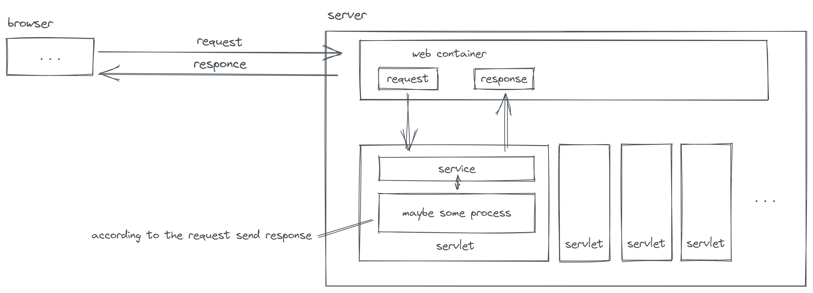

# Servlet

## 1 浅谈 Servlet

> **Servlet**（Server Applet），全称**Java Servlet**。是用[Java](https://zh.wikipedia.org/wiki/Java)编写的[服务器](https://zh.wikipedia.org/wiki/服务器)端[程序](https://zh.wikipedia.org/wiki/程序)。其主要功能在于交互式地浏览和修改数据，生成动态[Web](https://zh.wikipedia.org/wiki/Web)内容。狭义的Servlet是指Java语言实现的一个[接口](https://zh.wikipedia.org/wiki/接口)，广义的Servlet是指任何实现了这个Servlet接口的[类](https://zh.wikipedia.org/wiki/类_(计算机科学))，一般情况下，人们将Servlet理解为后者。

在我目前看来，Servlet 最具有特点的地方是可以动态的生成页面内容。

要了解它的运作原理，就需要明白 Servlet 这一名词包含的一般前提。首先，继承了 HttpServlet 的类就是 Servlet。它当然不是独立运作的，要使它发挥作用，那么至少还需要一个 Web 容器。当一个请求从客户端访问主机的 Web 容器所监听的端口时（用户在浏览器中输入域名并访问它），Web 容器就会将请求的内容封装起来，根据请求的路径转发到对应处理该请求的 Servlet（这个路径转发的功能一般称为 Dispatcher ），随后 Servlet 根据请求进行相关处理或返回一些数据（在浏览器中显示页面内容）。

> 要编写一个完善的HTTP服务器，以HTTP/1.1为例，需要考虑的包括：
>
> - 识别正确和错误的HTTP请求；
> - 识别正确和错误的HTTP头；
> - 复用TCP连接；
> - 复用线程；
> - IO异常处理；
> - ...
>
> 这些基础工作需要耗费大量的时间，并且经过长期测试才能稳定运行。如果我们只需要输出一个简单的HTML页面，就不得不编写上千行底层代码，那就根本无法做到高效而可靠地开发。
>
> 因此，在JavaEE平台上，处理TCP连接，解析HTTP协议这些底层工作统统扔给现成的Web服务器去做，我们只需要把自己的应用程序跑在Web服务器上。为了实现这一目的，JavaEE提供了Servlet API，我们使用Servlet API编写自己的Servlet来处理HTTP请求，Web服务器实现Servlet API接口，实现底层功能：
>
> ```ascii
>                  ┌───────────┐
>                  │My Servlet │
>                  ├───────────┤
>                  │Servlet API│
> ┌───────┐  HTTP  ├───────────┤
> │Browser│<──────>│Web Server │
> └───────┘        └───────────┘
> ```
>
> 原文链接：https://www.liaoxuefeng.com/wiki/1252599548343744/1304265949708322

在详细一些来讲，当用户通过浏览器（或许是客户）端访问 Tomcat 的时候通常使用的 Get 或者 Post 方式，但是总归是一条请求。Web 容器此时会产生两个对象，即请求对象和响应对象。当这种请求第一次需要处理的时候，就会生成一个对应处理该类请求的 Servlet 对象，而 Servlet 会通过 Service 方法获得请求对象和响应对象，然后 Servlet 根据请求来填充响应（这个部分即是开发者所需要做的），最终 Web 容器再将响应送回浏览器（或许是客户）端。

Web 容器、Web 服务器和应用服务器名词概念？ // TODO



## 2 通过 Maven 引入 Servlet

Oracle 将 Servlet 移交给 Eclipse 之后要求禁止使用 Java 商标，因此包名也从 javax.servlet 改成了 jakarta.servlet。

从 Maven 引入 Servlet，5.0.0 的引用是这样的：

```xml
<dependency>
        <groupId>jakarta.servlet</groupId>
        <artifactId>jakarta.servlet-api</artifactId>
        <version>5.0.0</version>
        <scope>provided</scope>
</dependency>
```

## 3  Using Servlet ~

首先在开始接触使用 Servlet API 前，先回顾一下编写 Servlet 的目的：

> 在我目前看来，Servlet 最具有特点的地方是可以动态的生成 Web 内容 . . .

Web 容器帮助我们处理了 TCP 连接以及解析 HTTP 协议这些底层繁琐的工作。因此我们在 Servlet 主要做的事情是根据请求内容来返回请求所需要的资源上。

在真正开始编写 Servlet 代码前首先需要下载 Web 容器：

### 3. 1  Hello Servlet（ HTTPServletRequest、HTTPServletResponse ）

```java
@WebServlet(urlPatterns = "/hello")
public class HelloServlet extends HttpServlet {
    @Override
    protected void doGet(HttpServletRequest request, HttpServletResponse response) throws IOException {
        response.setContentType("text/html");
        PrintWriter writer = response.getWriter();
        writer.print("Hello Servlet");
        writer.flush();
    }

    @Override
    protected void doPost(HttpServletRequest request, HttpServletResponse response) throws IOException {
        doGet(request, response);
    }
}
```

在 Servlet 的早期版本中，需要我们在 web.xml 中配置路径映射，就像这样：

```xml
<servlet>
    <servlet-name>hello</servlet-name>
    <servlet-class>HelloServlet</servlet-class>
</servlet>
<servlet-mapping>
    <servlet-name>hello</servlet-name>
    <url-pattern>/hello</url-pattern>
</servlet-mapping>
```

但在 Servlet 5.0.0 中可以直接使用注解来配置路径映射。（这真的方便了好多！）

此时运行 Tomcat 之后，访问 http://localhost:8080/context_name/hello 就可以得到在网页文档上输出的 Hello Servlet。刚刚路径的 context_name 并不是一个绝对值，这取决于你设置的应用程序上下文：如果你的 Web 容器使用的是 IDEA 集成的 Tomcat，那么你可以通过点击运行按钮左侧的 Tomcat 下拉框选择编辑配置，然后选择 " 部署 — 应用程序上下文（ context ）" 来编辑最开始我们所说的 context_name 路径。

HelloServlet 继承的 HttpServlet 使它可以重写 doGet 与 doPost 方法，这两个方法代表了请求该路径时使用的不同方式（ Get 或 POST ）。

```java
protected void doGet(HttpServletRequest request, HttpServletResponse response)
protected void doPost(HttpServletRequest request, HttpServletResponse response)
```

HttpServletRequest 及 HttpServletResponse 对应着封装好的请求内容和响应内容，通过它们可以获取几乎所有的 HTTP 请求、设置几乎所有的 HTTP 响应的信息。

在 doGet() 中，我们有下述代码：

```java
response.setContentType("text/html");
PrintWriter writer = response.getWriter();
writer.print("Hello Servlet");
writer.flush();
```

对于客户端访问路径 /hello 时，该 Servlet 会设置响应内容的类型为 HTML 格式，然后获取响应的字符输出流，向其中写入 " Hello Servlet " 这样的字符串，最后使用 flush() 来将缓冲区的内容送到客户端。（注意，因为 Web 服务器会复用 TCP 连接的原因，不要使用 close() 来关闭输出流）

这样你在浏览器中看到了一句 Hello Servlet。（当然，你也可以在字符输出流中写入 HTML 标签等）

### 3. 2 重定向

重定向一般用于资源或功能转移时，当客户端向一个路径发送请求，Servlet 可以通过 response.sendRedirect("path") 设置响应。当客户端收到该响应时，它会转而继续请求 path 对应的路径，进而，它也就会被其它的 Servlet 处理。

### 3. 3 内部转发

内部转发是另一种让在当前 Servlet 中使其它 Servlet 处理请求的方式，Servlet 可以通过 request.getRequestDispatcher("path").forward(request, response) 在 Web 容器内部直接转交到 path 对应路径的 Servlet 来处理。

### 3. 4  Cookie

浅谈 HTTP 协议 // TODO

在一些场景中，在同一个网站的多个不同页面内需要一些数据持存，例如登录信息、购物车列表又或者是个性化或主题等设置。但 HTTP 协议是无状态协议，也就是说，请求完成后不会持久化对应的信息。Cookie 就是用来记录这样信息的一种手段，Cookie 存储在客户端，并由浏览器进行管理。

Cookie 总是在服务端响应时在 HTTP 报文的首部中设置了 Set-Cookie 之后，它们才会被客户端保存起来。

你可以通过：

```java
Cookie cookie = new Cookie(key, value);
response.addCookie(cookie);
```

来新建 Cookie 并在响应的首部中设置这个（或多个） Cookie，你还可以通过 Cookie 类的 setMaxAge() 或 setContext() 等方法来设置 Cookie 的各种属性。

如果想要获得请求中的 Cookie，可以通过：

```java
Cookie[] cookies = req.getCookies();
if (cookies != null) {
    for (Cookie cookie : cookies) {
        if (cookie.getName().equals(key)) {
            return cookie.getValue();
        }
    }
}
```

来获取指定的 Cookie 值。

### 3. 5  Session

因为 Cookie 的值由浏览器管理，因此它们可以在客户端处修改，这或许有些不安全，Session 则解决了这个问题。

需要说明的是，Session 建立在 Cookie 的基础之上，首次响应的首部中也会有 Set-Cookie 字段。不同的是，Cookie 中不直接存放多个 key = value 这样的数据，而是间接的，存放一个 JSESSIONID = xxxxx 字样的数据。

这个 JSESSIONID 将会用作在 Servlet 中识别 Session 的值，而详细的键值则存储在 Web 容器中，并不由客户端管理。

可以直接这样设置 Session 中的键值。如果请求原本没有 JSESSIONID，那么，响应时会在响应的首部设置，而 JSESSIONID 对应的 Session 所包含的 key 与 value 的信息则存储在 Web 容器中。（在 Tomcat 中 Session 是其以 ConcurrentHashMap 这种结构（二级哈希表）维护的一种映射表）

```java
HttpSession session = request.getSession();
session.setAttribute(key, value); // Add or modify.
session.getAttribute(key);        // Get.
session.removeAttribute(key);     // Remove.
```
